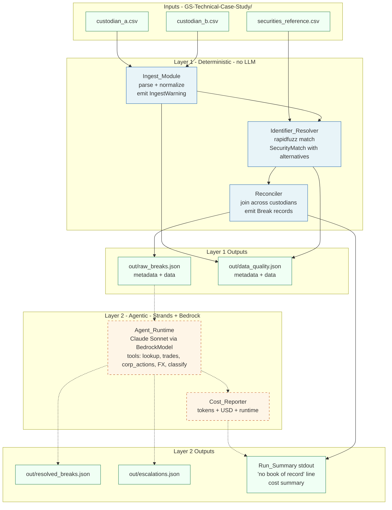

# Design Document

## Overview

This document specifies how the seven thought-leadership hooks in `requirements.md` are realized on top of the baseline two-layer reconciliation pipeline defined in #[[file:.kiro/steering/tech.md]]. Layer 1 — Ingest_Module, Identifier_Resolver, Reconciler — runs deterministically over the three CSVs in `GS-Technical-Case-Study/` and emits two JSON artifacts (`out/raw_breaks.json`, `out/data_quality.json`) wrapped in a `{metadata, data}` envelope. Layer 2 — Agent_Runtime, Cost_Reporter — consumes the raw break set, calls Strands `@tool` functions against Bedrock Claude Sonnet in `us-west-2`, and emits `out/resolved_breaks.json` and `out/escalations.json` with the same envelope plus a per-run cost summary. The hooks are scoped to keep Layer 1 LLM-free, to keep the Cost_Reporter degradable to Layer-1-only mode, and to fit inside the 80-LOC executable budget from Requirement 7.

## Architecture

The pipeline runs as a single Python process. Layer 1 is reachable as `uv run python -m code.pipeline.reconcile`; the full pipeline is reachable as `uv run python -m code.run`. Layer 1 must not import from `code/agent.py` or any Strands module; this is the firewall that keeps Requirements 1 through 5 deterministic and reviewable without AWS credentials.



The dotted edges denote the Layer 1 / Layer 2 firewall. Solid edges are deterministic dependencies. The Layer 2 path is optional — Requirement 6 AC 2 specifies that when Agent_Runtime is not invoked, Cost_Reporter still prints a Layer-1-only summary.

## Components and Interfaces

Each subsection lists the component's responsibilities, its public interface, and the requirement IDs it satisfies. Component names match the glossary in `requirements.md` verbatim.

### Ingest_Module

Lives in `code/pipeline/ingest.py`. Parses each custodian CSV into a list of `Position` records and a list of `IngestWarning` records. Owns every coercion (paren negatives, non-ISO dates, year mismatches, ticker-dot preservation) and emits a typed warning for each one — coercions never happen silently. Reads CSVs row-by-row so warnings can carry zero-based `source_row_index`. Does not call Identifier_Resolver directly; instead, it returns the raw `symbol` or `security_description` field on the `Position` record and lets the Reconciler invoke the resolver. This keeps the ingest step pure (CSV → typed records) and testable without the security master.

Public interface:

- `ingest_custodian_a(path: Path) -> tuple[list[Position], list[IngestWarning]]`
- `ingest_custodian_b(path: Path) -> tuple[list[Position], list[IngestWarning]]`
- `parse_paren_int(raw: str) -> tuple[int, IngestWarning | None]`
- `parse_flexible_date(raw: str, configured_year: int) -> tuple[date, list[IngestWarning]]`

**Satisfies:** Requirement 1 (AC 1, 2, 3, 4, 6, 7, 8); Requirement 4 AC 5.

### Identifier_Resolver

Lives in `code/tools/securities.py` and is also exposed as the `@tool`-decorated `lookup_security` function for Layer 2. The Layer 1 entrypoint is the plain Python function; the `@tool` wrapper is a thin shim so the agent can call the same logic. Builds a normalized index over `securities_reference.csv` once per run (lowercase ticker, lowercase name) and uses `rapidfuzz.process.extract` against the `name` column for description queries. Preserves periods in tickers (`BRK.A` is matched as `brk.a`, not `brka`). Returns a `SecurityMatch` with confidence in `[0, 1]`, every candidate at or above `fuzzy_threshold / 2` listed in `alternatives`, and a `reason` string explaining the decision (`exact_ticker`, `fuzzy_name`, `ambiguous_top_two`, `below_threshold`).

Public interface:

- `resolve(query: str, query_kind: Literal["ticker", "description"]) -> SecurityMatch`
- `@tool def lookup_security(query: str) -> SecurityMatch` (Layer 2 wrapper)

**Satisfies:** Requirement 2 (AC 1, 2, 3, 4, 6); Requirement 1 AC 5.

### Reconciler

Lives in `code/pipeline/reconcile.py`. Owns the join logic across the two custodians without a book of record. For each `Position` from each custodian, calls Identifier_Resolver, then groups positions by `security_id` (or by `null` for ambiguous rows). For each group, classifies the result into a `break_type` per the canonical Break schema in #[[file:.kiro/steering/product.md]]: `quantity_mismatch`, `value_mismatch`, `position_type_mismatch`, `missing_at_custodian` (one-sided, present at only one custodian), or `identifier_ambiguous` (ambiguous SecurityMatch). Sets `book_quantity`, `book_market_value`, `position_type_book` to `null` because no book of record exists in this case study. Computes a stable `break_id` by hashing `(as_of_date, security_id_or_query, custodian)`. Attaches the row's IngestWarnings to `Break.ingest_warnings`. Writes `out/raw_breaks.json` and `out/data_quality.json` through the OutputArtifact envelope.

Public interface:

- `reconcile(positions_a: list[Position], positions_b: list[Position], warnings: list[IngestWarning], as_of: date) -> list[Break]`
- `write_artifacts(breaks: list[Break], warnings: list[IngestWarning], inputs: dict[str, Path], as_of: date) -> None`

**Satisfies:** Requirement 1 AC 6; Requirement 2 AC 3, 5; Requirement 4 AC 2, 3, 4; Requirement 5 (all ACs).

### Agent_Runtime

Lives in `code/agent.py` and is invoked from `code/run.py`. Constructs a Strands `Agent` with `BedrockModel(model_id="anthropic.claude-sonnet-4-..." , region_name="us-west-2")` and the `@tool` set listed in #[[file:.kiro/steering/tech.md]] (`lookup_security`, `get_recent_trades`, `get_corporate_actions`, `get_settlement_status`, `get_fx_rate`, `classify_break`, `propose_resolution`, `escalate_to_human`). Iterates over the raw break set; for each break, gives the agent the break record plus the security master row and asks it to produce a classified, explained Resolution. Captures token usage from each model response. Writes `out/resolved_breaks.json` and `out/escalations.json` through the same OutputArtifact envelope. Does not mutate inputs or call any state-changing surface.

Public interface:

- `build_agent() -> strands_agents.Agent`
- `resolve_breaks(breaks: list[Break]) -> tuple[list[ResolvedBreak], list[Escalation], TokenUsage]`

**Satisfies:** Requirement 6 AC 1 (token capture); Requirement 7 AC 3 (Layer 2 location).

### Run_Summary

Lives in `code/run.py` (and a minimal version in `code/pipeline/reconcile.py` for the Layer-1-only entrypoint). Prints to stdout the closing report at the end of every run. The opening line of the closing report is the no-book-of-record statement from Requirement 4 AC 1: *"No book of record was supplied; reconciling custodian_a vs custodian_b only."* Subsequent lines name the reconciliation pair, summarize break counts by type, and (in Layer 2 runs) hand control to Cost_Reporter for token and cost lines.

Public interface:

- `print_run_summary(breaks: list[Break], cost: CostSummary | None) -> None`

**Satisfies:** Requirement 4 AC 1, 4.

### Cost_Reporter

Lives in `code/run.py` alongside Run_Summary. Aggregates token usage across all agent turns and computes cost using fixed Bedrock pricing constants pinned in source (with an inline comment citing the Bedrock pricing source per Requirement 6 AC 3). Measures wall-clock runtime via `time.monotonic()` between the entrypoint start and the moment the summary is printed. Degrades gracefully: when invoked through the Layer-1 entrypoint, prints only `total_breaks` and `runtime_seconds` and does not raise. When the Bedrock response lacks token metadata for one or more turns, treats those turns as zero-token and prints a single `missing_token_usage` warning line naming the affected turn count.

Public interface:

- `class CostSummary(BaseModel)` with fields per Requirement 6 AC 1
- `compute_cost(usage: TokenUsage, model_id: str) -> float`
- `print_cost_summary(summary: CostSummary, mode: Literal["full", "layer1_only"]) -> None`

**Satisfies:** Requirement 6 (all ACs); Requirement 7 AC 3.

## Data Models

This section is the Low-Level-Design (LLD) layer for the components above. Pydantic v2 model sketches. These are field/constraint contracts, not implementations. All models live in `code/models.py` except where noted. The Break schema must remain consistent with the canonical sketch in #[[file:.kiro/steering/product.md]].

```python
from datetime import date, datetime
from typing import Literal
from pydantic import BaseModel, Field, ConfigDict


class Position(BaseModel):
    """Normalized position record emitted by Ingest_Module.

    The `raw_query` field carries the original ticker or description for
    later resolution; security_id is intentionally absent at this stage
    because resolution happens in the Reconciler.
    """

    model_config = ConfigDict(frozen=True)

    custodian: Literal["custodian_a", "custodian_b"]
    raw_query: str = Field(min_length=1)              # ticker or description
    quantity: int                                      # signed; short = negative
    market_value: float                                # signed USD
    position_type: Literal["LONG", "SHORT"]
    as_of_date: date
    source_row_index: int = Field(ge=0)
    raw_source_row: dict[str, str]


class IngestWarning(BaseModel):
    """Structured warning emitted for any coercion or quality concern.

    `type` is a closed set so downstream code (and tests) can assert on it.
    """

    model_config = ConfigDict(frozen=True)

    type: Literal[
        "paren_negative_coerced",
        "non_iso_date_coerced",
        "year_mismatch",
        "ticker_dot_preserved",
        "fuzzy_match_below_threshold",
    ]
    severity: Literal["info", "warning", "error"] = "warning"
    source_file: str
    source_row_index: int = Field(ge=0)
    message: str
    detail: dict[str, str | int | float | None] = Field(default_factory=dict)


class SecurityMatch(BaseModel):
    """Identifier_Resolver return value.

    `security_id` is None when no candidate clears `fuzzy_threshold` or when
    the top-two candidates are within `ambiguity_epsilon` of each other.
    """

    security_id: str | None
    confidence: float = Field(ge=0.0, le=1.0)
    alternatives: list[dict[str, float | str]] = Field(default_factory=list)
    reason: Literal[
        "exact_ticker",
        "fuzzy_name",
        "ambiguous_top_two",
        "below_threshold",
    ]


class Break(BaseModel):
    """Canonical break record per #[[file:.kiro/steering/product.md]].

    book_* fields are nullable so the schema accommodates a future book of
    record without modification (Requirement 4 AC 2).
    """

    break_id: str = Field(min_length=8)
    as_of_date: date
    security_id: str | None                            # null on identifier_ambiguous
    custodian: Literal["custodian_a", "custodian_b", "both"]
    break_type: Literal[
        "missing_in_book",
        "missing_at_custodian",
        "quantity_mismatch",
        "value_mismatch",
        "position_type_mismatch",
        "identifier_unresolved",
        "identifier_ambiguous",
    ]
    book_quantity: int | None = None
    custodian_quantity: int | None = None
    quantity_delta: int | None = None
    book_market_value: float | None = None
    custodian_market_value: float | None = None
    value_delta: float | None = None
    position_type_book: Literal["LONG", "SHORT"] | None = None
    position_type_custodian: Literal["LONG", "SHORT"] | None = None
    raw_source_row: dict[str, str]
    ingest_warnings: list[IngestWarning] = Field(default_factory=list)


class RunSummary(BaseModel):
    """Stdout-formatted run summary; full mode includes cost fields."""

    total_breaks: int = Field(ge=0)
    breaks_by_type: dict[str, int] = Field(default_factory=dict)
    auto_cleared_count: int | None = None              # None in Layer-1-only
    escalated_count: int | None = None
    tokens_input: int | None = None
    tokens_output: int | None = None
    estimated_cost_usd: float | None = None
    runtime_seconds: float = Field(ge=0.0)
    mode: Literal["full", "layer1_only"]


class OutputArtifact(BaseModel):
    """Top-level envelope written to every JSON artifact in out/."""

    metadata: "ArtifactMetadata"
    data: list[dict]


class ArtifactMetadata(BaseModel):
    ruleset_version: str = Field(pattern=r"^\d+\.\d+\.\d+$")
    code_commit: str                                   # git short SHA or "uncommitted"
    input_file_sha256s: dict[str, str]                 # filename -> hex digest
    as_of_date: date
    generated_at: datetime
```

## Key Algorithms (LLD)

Pseudocode. Numbered steps, not Python. Implementation lives in the components named above.

### A. CSV parsing with warning emission

Applies to both `custodian_a.csv` and `custodian_b.csv`. Custodian A has clean tickers and `MM/DD/YYYY` dates; Custodian B has descriptions, paren negatives, and four date formats. The same algorithm runs against both — the warning types fire only where the inputs trigger them.

1. Open the CSV with `csv.DictReader`; remember the file path and a row counter starting at 0.
2. For each row:
   1. Read the quantity / shares field as a string. If it starts with `(` and ends with `)`, strip the parens, parse the inner value as an int, negate it, and emit an `IngestWarning` of type `paren_negative_coerced` with the raw and coerced values in `detail`.
   2. Read the market-value field with the same paren rule (Custodian B has `(4250000)` for NVDA's value, see lines in the data).
   3. Read the date field. Try ISO 8601 first; if it does not match `^\d{4}-\d{2}-\d{2}$`, parse with `dateutil.parser.parse(dayfirst=False)` and emit `non_iso_date_coerced` with the detected format token in `detail` (e.g. `MM/DD/YYYY`, `M/D/YY`, `DD-MMM-YYYY`).
   4. Compare the parsed year against the run's configured `as_of_date.year`. If they differ, emit `year_mismatch` with both years in `detail`. The configured year is the only year considered authoritative for the run; the parsed value is preserved on the Position so the Break record retains the source-row truth.
   5. Read the identifier field. For Custodian A, that is `symbol`; for Custodian B, that is `security_description`.
      - If the field looks like a ticker (uppercase, no spaces) and contains a `.`, emit `ticker_dot_preserved` and store the value verbatim. *Do not* uppercase, lowercase, or strip the dot.
      - Otherwise, store the description verbatim with leading/trailing whitespace stripped only.
   6. Determine `position_type`. For Custodian A, read the `position_type` column. For Custodian B, derive it from the sign of the parsed quantity (negative ⇒ `SHORT`, positive ⇒ `LONG`).
   7. Construct a `Position` and append it to the result list. Append all warnings produced for this row to a parallel warnings list, tagged with the row index.
3. Return `(positions, warnings)`.

### B. Identifier resolution with ambiguity detection

Single algorithm covers ticker queries (Custodian A) and description queries (Custodian B). The core anti-pattern this avoids: collapsing ambiguity into a single best-guess match. For `"Alphabet Inc"`, both `GOOGL` and `GOOG` are correct candidates; the resolver must surface that.

1. On Identifier_Resolver construction, build two index dicts from `securities_reference.csv`:
   - `by_ticker`: lowercase ticker → security_id (preserves periods; `brk.a` is a valid key).
   - `by_name_choices`: list of `(security_id, lowercase_name)` for `rapidfuzz` extraction.
2. On `resolve(query, query_kind)`:
   1. If `query_kind == "ticker"`: lower-case the query, look it up in `by_ticker`. If hit, return `SecurityMatch(security_id=hit, confidence=1.0, alternatives=[], reason="exact_ticker")`.
   2. Else, run `rapidfuzz.process.extract(query.lower(), [n for _, n in by_name_choices], scorer=fuzz.WRatio, limit=5)`. Map each result back to its `security_id` and divide the score by 100 to land in `[0, 1]`.
   3. Sort the candidates by confidence descending.
   4. If `len(candidates) == 0` or `top.confidence < fuzzy_threshold`:
      - Set `alternatives = [c for c in candidates if c.confidence >= fuzzy_threshold / 2]`.
      - Return `SecurityMatch(security_id=None, confidence=top.confidence_or_zero, alternatives=alternatives, reason="below_threshold")`.
   5. If `len(candidates) >= 2 and (top.confidence - second.confidence) < ambiguity_epsilon`:
      - Return `SecurityMatch(security_id=None, confidence=top.confidence, alternatives=[top, second], reason="ambiguous_top_two")`.
      - This branch is the one `"Alphabet Inc"` exercises: `GOOGL` and `GOOG` both score very close because the names differ only in `CLASS A` / `CLASS C`.
   6. Otherwise, return `SecurityMatch(security_id=top.security_id, confidence=top.confidence, alternatives=[c for c in candidates[1:] if c.confidence >= fuzzy_threshold / 2], reason="fuzzy_name")`.

### C. Break detection across two custodians without a book of record

This is the part of the design where the *lack* of a book of record is the deliberate point. Without a book, we cannot tell a true break from a sleeve split — but we can still surface every disagreement, label each row's `break_type` honestly, and let Layer 2 (or a human) classify intent.

1. For each Position in `positions_a + positions_b`, call `Identifier_Resolver.resolve(...)`. Collect the resulting `SecurityMatch`. If `match.security_id is None`, mark this position as ambiguous; else attach the resolved `security_id`.
2. Partition positions:
   - `ambiguous`: positions where `match.security_id is None`.
   - `resolved`: positions grouped by `security_id`.
3. For each ambiguous position, emit one Break with `break_type="identifier_ambiguous"`, `security_id=null`, the row's `raw_source_row`, and a `fuzzy_match_below_threshold` warning attached.
4. For each `(security_id, group)` in `resolved`:
   1. Find `pa = group.first(custodian="custodian_a")`, `pb = group.first(custodian="custodian_b")`.
   2. If `pa is None and pb is not None`: emit Break with `break_type="missing_at_custodian"`, `custodian="custodian_a"`, `custodian_quantity=null`, populate the `pb` side. (One-sided position; per Requirement 3 AC 5.)
   3. If `pb is None and pa is not None`: symmetric, with `custodian="custodian_b"`.
   4. If both present:
      - If `pa.position_type != pb.position_type`: emit Break with `break_type="position_type_mismatch"`. **Both** `position_type_*` fields and the `quantity_*` / `quantity_delta` fields SHALL be populated on the same Break record so the quantity divergence is not lost. NVDA and BRK.A in the case-study data hit this branch (NVDA: 10000 LONG vs -5000 SHORT; BRK.A: 30 LONG vs -10 SHORT).
      - Else if `pa.quantity != pb.quantity`: emit Break with `break_type="quantity_mismatch"`, `quantity_delta = pa.quantity - pb.quantity`. AAPL, AMZN, MSFT, V hit this branch.
      - Else if `abs(pa.market_value - pb.market_value) > value_epsilon`: emit Break with `break_type="value_mismatch"`. Reserved for cases where quantities tie but valuations diverge (e.g. FX or stale prices).
      - Else: no break for this security.
5. For each emitted Break, set `book_quantity = book_market_value = position_type_book = None` (Requirement 4 AC 3) and `book_id = sha256(f"{as_of_date}|{security_id_or_query}|{custodian}")[:12]`.
6. Attach to each Break the `ingest_warnings` produced for the source row(s) that participated in the Break (Requirement 1 AC 6).

### D. Output envelope construction

Every JSON artifact under `out/` shares the same envelope so a reviewer opening any one file sees the same audit fields at the top.

1. At pipeline start, compute and cache:
   - `code_commit`: run `git rev-parse --short HEAD`. If the command returns non-zero or git is not installed, set the literal string `"uncommitted"` (Requirement 5 AC 3).
   - `input_file_sha256s`: for each input CSV, read the file in binary, compute `hashlib.sha256` of the byte content, store the hex digest keyed by basename. Use `hashlib.file_digest(f, "sha256")` on Python 3.13 for streaming; fall back to `sha256(f.read()).hexdigest()` if needed. (See Open Design Questions.)
   - `ruleset_version`: a pinned `"0.1.0"` constant in `code/run.py`.
   - `as_of_date`: from CLI flag or default `2026-01-02`.
   - `generated_at`: `datetime.now(timezone.utc).isoformat()`.
2. To write any artifact, build `OutputArtifact(metadata=cached_metadata, data=[record.model_dump(mode="json") for record in records])` and `json.dump(...)` it.
3. Apply this envelope to `out/raw_breaks.json`, `out/data_quality.json`, `out/resolved_breaks.json`, and `out/escalations.json` (Requirement 5 AC 4). Do not invent additional artifacts in this design.

### E. Cost computation and graceful degradation

The Cost_Reporter must run end-to-end whether or not Bedrock is reachable, and must not raise when token metadata is missing. The numbers are honest at the cost of being conservative — missing usage is treated as zero, never extrapolated.

1. At pipeline start, capture `t0 = time.monotonic()`.
2. Initialize `tokens_input = 0`, `tokens_output = 0`, `missing_turns = 0`.
3. After every agent turn:
   - If the Strands response carries a `usage` block with `input_tokens` and `output_tokens` fields, add them to the running totals.
   - Else, increment `missing_turns`.
4. At pipeline end, capture `t1 = time.monotonic()` and compute `runtime_seconds = t1 - t0`.
5. If running in Layer-1-only mode (no agent invoked), print `RunSummary(mode="layer1_only", total_breaks=..., runtime_seconds=...)` and return without raising (Requirement 6 AC 2).
6. Else compute:
   - `cost_usd = (tokens_input / 1_000_000) * INPUT_RATE + (tokens_output / 1_000_000) * OUTPUT_RATE`
   - Both rate constants live in `code/run.py` with an inline comment citing the Bedrock pricing source (Requirement 6 AC 3).
7. If `missing_turns > 0`, print `missing_token_usage warning: N turn(s) had no usage metadata; their cost is treated as $0.00` (Requirement 6 AC 4).
8. Print the full `RunSummary` with `mode="full"`.

## File Output Contracts

| Path | Schema | When written | Governing requirement |
|---|---|---|---|
| `out/raw_breaks.json` | `OutputArtifact` with `data: list[Break]` | After Reconciler completes (Layer 1) | Req 5 AC 4; Req 4 AC 2, 3 |
| `out/data_quality.json` | `OutputArtifact` with `data: list[IngestWarning]` grouped by source file then row index | After Ingest_Module + Identifier_Resolver complete (Layer 1) | Req 1 AC 7; Req 5 AC 4 |
| `out/resolved_breaks.json` | `OutputArtifact` with `data: list[ResolvedBreak]` (Break enriched with classification, evidence, confidence, proposed_resolution per #[[file:.kiro/steering/product.md]]) | After Agent_Runtime completes (Layer 2 only) | Req 5 AC 4 |
| `out/escalations.json` | `OutputArtifact` with `data: list[Escalation]` | When the agent's `escalate_to_human` tool fires (Layer 2 only) | Req 5 AC 4 |
| stdout: no-book-of-record line | Literal string per Req 4 AC 1 | First line of Run_Summary, every run | Req 4 AC 1, 4 |
| stdout: cost summary | `RunSummary` fields per Req 6 AC 1 (full) or Req 6 AC 2 (layer1_only) | Last line(s) of Run_Summary | Req 6 (all) |

`out/report.csv` is mentioned in #[[file:.kiro/steering/tech.md]] as a baseline artifact and is left as-is by this design — it does not require the metadata envelope because it is not JSON. If a future iteration adds CSV-side metadata, the design point is that the same `ArtifactMetadata` model can be serialized as a header comment block.

## Error Handling

The pipeline distinguishes three failure modes by severity. Coercions and resolution ambiguities are surfaced as data — not raised — so the artifacts always exist for review. Hard infrastructure failures fail loudly. The Layer 2 path degrades to Layer 1 rather than aborting.

| Mode | Examples | Handling |
|---|---|---|
| **IngestWarning (info / warning / error)** | Paren negative coerced; non-ISO date coerced; year mismatch; ticker dot preserved; fuzzy match below threshold | Captured as a typed `IngestWarning`, attached to the source row's Break, and consolidated in `out/data_quality.json`. The pipeline continues. (Req 1 AC 1–8.) |
| **Identifier ambiguity** | `"Alphabet Inc"` → `GOOGL` and `GOOG` within `ambiguity_epsilon`; query with no candidate above `fuzzy_threshold` | Reconciler emits a Break with `break_type="identifier_ambiguous"`; `security_id` is `null`; both candidates listed in `alternatives`; a `fuzzy_match_below_threshold` warning is attached. The pipeline continues. (Req 2 AC 3, 5; Req 1 AC 5.) |
| **Layer 2 degradation** | No AWS credentials; Bedrock returns no `usage` block for one or more turns; user invokes the Layer-1-only entrypoint | Cost_Reporter runs in `layer1_only` mode and prints the trimmed summary (Req 6 AC 2). Per-turn missing usage adds zero cost and increments `missing_turns`; a `missing_token_usage` warning line names the affected count (Req 6 AC 4). The pipeline does not raise. |
| **Hard failures** | Missing input CSV; malformed JSON in security master; OS-level I/O error | Raise the underlying exception. These are not graceful-degradation territory — they mean the run cannot produce trustworthy artifacts. The CLI exits non-zero. |

Two boundary contracts deserve explicit mention because they show up in tests:

- **Year mismatch is non-fatal.** A row dated `2025-01-02` in a run configured for `2026-01-02` produces a warning, not an exception. The Position retains the source-row truth (`as_of_date.year == 2025`); the run's configured date is what governs the metadata block and reconciliation grouping.
- **Ambiguity does not silently pick a winner.** When the top-two candidate confidences are within `ambiguity_epsilon`, the resolver returns `security_id=None` and reason `ambiguous_top_two`. There is no tiebreaker by alphabetical order, by `security_id`, or by appearance order in the master. This is a deliberate choice — silent disambiguation is the failure mode this design is built to prevent.

## Configuration and Defaults

| Constant | Default | Rationale |
|---|---|---|
| `fuzzy_threshold` | `0.85` | Empirically, `rapidfuzz.WRatio` on the case-study description set scores `"Apple Inc Common Stock"` vs `"APPLE INC COMMON STOCK"` at ~95 and `"Alphabet Inc"` vs `"ALPHABET INC CLASS A"` at ~90; setting the bar at 0.85 admits clean matches and rejects the noise tail. Tunable per deployment. |
| `ambiguity_epsilon` | `0.05` | The diagnostic case is `"Alphabet Inc"` ↔ `GOOGL`/`GOOG`. Their `WRatio` scores against this query differ by ~1–2 points out of 100 because the only distinguishing token is `CLASS A` vs `CLASS C`. An epsilon of 0.05 (5 points) catches this and similar share-class collisions without firing on legitimately-distinct names. **Borderline case to validate at implementation time:** Custodian B's `"Berkshire Hathaway Class A Inc"` query against the master's `BERKSHIRE HATHAWAY INC CLASS A` (SEC0009) and `BERKSHIRE HATHAWAY INC CLASS B` (SEC0010). The `WRatio` delta there is expected ~3–10 points. Phase 3 task 16 of the implementation plan adds a smoke-check that asserts `delta > epsilon` for this query; if it does not, BRK.A surfaces as `identifier_ambiguous` rather than resolving to SEC0009. Either outcome is honest behavior, but the headline expected ledger in #[[file:.kiro/steering/product.md]] assumes a clean resolution. |
| `value_epsilon` | `0.01` USD | Floating-point dust tolerance for the `value_mismatch` branch; below the smallest dollar move a custodian would report. |
| `bedrock_model_id` | `anthropic.claude-sonnet-4-20250514-v1:0` (or current Sonnet) | Per #[[file:.kiro/steering/tech.md]]; final model id confirmed against `aws-docs` MCP at implementation time. |
| `aws_region` | `us-west-2` | Pinned per workspace standards; never read from environment for this case study. |
| `INPUT_RATE` (USD per 1M input tokens) | `3.00` | Bedrock list price for Claude Sonnet 4 input tokens at time of writing; constant carries an inline cite to the Bedrock pricing page per Req 6 AC 3. To be confirmed at implementation time via `awslabs.aws-pricing-mcp-server`. |
| `OUTPUT_RATE` (USD per 1M output tokens) | `15.00` | Bedrock list price for Claude Sonnet 4 output tokens; same cite as above. |
| `ruleset_version` | `"0.1.0"` | First version of the ruleset; bumped on any Reconciler logic change so a reviewer can correlate output with logic. |
| `as_of_date` | `2026-01-02` | Per `Instructions.md`. The 2025 dates in the CSV rows are deliberately surfaced as `year_mismatch` warnings rather than overridden silently. |

## Testing Strategy

Five test functions are named explicitly in Requirement 3. Each is a single `def test_...` in `code/tests/`, uses fixtures kept under `code/tests/fixtures/` (small CSV slices that exercise exactly one branch), and asserts only what its name claims. The full suite runs via `uv run pytest -v`.

| Test (Requirement 3 AC) | Fixture | Assertions |
|---|---|---|
| `test_paren_quantity_in_custodian_b_is_parsed_as_short_position` (AC 1) | `tests/fixtures/custodian_b_paren.csv` — single row with `(5000)` quantity | `position.quantity == -5000`; `position.position_type == "SHORT"`; exactly one `IngestWarning` with `type == "paren_negative_coerced"`. |
| `test_alphabet_inc_is_ambiguous_between_googl_and_goog_class_shares` (AC 2) | The full `securities_reference.csv` plus an in-memory `"Alphabet Inc"` Position | `match.security_id is None`; `{a["security_id"] for a in match.alternatives} == {"SEC0004", "SEC0005"}`; the Reconciler emits a Break with `break_type == "identifier_ambiguous"`. |
| `test_brka_dot_in_ticker_is_preserved_through_normalization` (AC 3) | `tests/fixtures/custodian_a_brka.csv` — single row with `BRK.A` | The ingested Position's `raw_query == "BRK.A"` (period intact); `Identifier_Resolver.resolve("BRK.A", "ticker").security_id == "SEC0009"`. |
| `test_2025_date_in_2026_eod_file_emits_year_mismatch_warning` (AC 4) | `tests/fixtures/custodian_b_year.csv` — single row dated `2025-01-02`; run configured `as_of_date=2026-01-02` | Exactly one `IngestWarning` with `type == "year_mismatch"`; the Position's `as_of_date.year == 2025` (the source-row truth is preserved). |
| `test_position_only_in_one_custodian_is_classified_as_one_sided` (AC 5) | `tests/fixtures/custodian_a_tsla_only.csv` + empty Custodian B | Exactly one Break with `security_id == "SEC0008"`, `break_type == "missing_at_custodian"`, `custodian == "custodian_b"`, `custodian_quantity is None` for the absent custodian, and the present custodian's quantity populated. |

A sixth implicit test target is the `OutputArtifact` envelope: every JSON file under `out/` is loaded post-run and asserted to have a top-level `metadata` object with all five required fields and a `data` array. This is *not* one of the five named tests but is a cheap suite-level invariant worth keeping.

## End-to-End Sequence (Layer 1 + Layer 2)

The diagram traces a single full run from `uv run python -m code.run` through artifact emission. Token-usage events surface inside the agent loop; warnings surface in Ingest_Module; the no-book-of-record line is printed by Run_Summary at the end.

```mermaid
sequenceDiagram
    autonumber
    actor User
    participant Run as code/run.py
    participant Ing as Ingest_Module
    participant Res as Identifier_Resolver
    participant Rec as Reconciler
    participant Out as OutputArtifact writer
    participant Ag as Agent_Runtime
    participant Bed as Bedrock Claude Sonnet
    participant Cost as Cost_Reporter
    participant Sum as Run_Summary

    User->>Run: uv run python -m code.run
    Run->>Cost: t0 = monotonic()
    Run->>Ing: ingest_custodian_a + ingest_custodian_b
    Ing-->>Ing: emit IngestWarning per coercion<br/>(paren_negative, non_iso_date, year_mismatch, ticker_dot)
    Ing->>Run: positions, warnings
    Run->>Rec: reconcile(positions, warnings, as_of)
    loop per Position
        Rec->>Res: resolve(raw_query, kind)
        Res-->>Rec: SecurityMatch
        opt below threshold or ambiguous
            Rec->>Rec: emit fuzzy_match_below_threshold warning
        end
    end
    Rec->>Out: write raw_breaks.json (with metadata envelope)
    Rec->>Out: write data_quality.json (with metadata envelope)

    Run->>Ag: resolve_breaks(breaks)
    loop per Break
        Ag->>Bed: Claude turn with break + tool surface
        Bed-->>Ag: response + usage{input_tokens, output_tokens}
        Ag->>Cost: record_usage(input, output) or missing
    end
    Ag->>Out: write resolved_breaks.json
    Ag->>Out: write escalations.json

    Run->>Sum: print_run_summary(...)
    Sum->>User: "No book of record was supplied;<br/>reconciling custodian_a vs custodian_b only."
    Sum->>Cost: t1 = monotonic(); compute cost_usd
    opt missing_turns > 0
        Cost->>User: missing_token_usage warning line
    end
    Cost->>User: total_breaks, auto_cleared, escalated,<br/>tokens_input, tokens_output,<br/>estimated_cost_usd, runtime_seconds
```

When the user invokes Layer 1 only (`uv run python -m code.pipeline.reconcile`), steps 9 through 13 are skipped and Run_Summary calls Cost_Reporter in `layer1_only` mode (Req 6 AC 2). The no-book-of-record line is printed in both modes (Req 4 AC 1).

## Requirements Traceability Matrix

Every acceptance criterion in `requirements.md` maps to at least one design section.

| Requirement | Design section(s) |
|---|---|
| **Req 1: Structured ingest warnings** | |
| &nbsp;&nbsp;AC 1 (paren_negative_coerced) | Algorithm A step 2.1; Ingest_Module |
| &nbsp;&nbsp;AC 2 (non_iso_date_coerced) | Algorithm A step 2.3; Ingest_Module |
| &nbsp;&nbsp;AC 3 (year_mismatch) | Algorithm A step 2.4; Ingest_Module |
| &nbsp;&nbsp;AC 4 (ticker_dot_preserved) | Algorithm A step 2.5; Ingest_Module |
| &nbsp;&nbsp;AC 5 (fuzzy_match_below_threshold) | Algorithm B step 2.4 + 2.5; Identifier_Resolver |
| &nbsp;&nbsp;AC 6 (warnings attached to Break) | Algorithm C step 6; Reconciler; Break model |
| &nbsp;&nbsp;AC 7 (out/data_quality.json) | File Output Contracts; Algorithm D |
| &nbsp;&nbsp;AC 8 (warning structure: type/severity/source_file/source_row_index/message) | IngestWarning model |
| **Req 2: Identifier resolution** | |
| &nbsp;&nbsp;AC 1 (SecurityMatch fields) | SecurityMatch model; Identifier_Resolver |
| &nbsp;&nbsp;AC 2 (below-threshold alternatives) | Algorithm B step 2.4 |
| &nbsp;&nbsp;AC 3 (ambiguity_epsilon → identifier_ambiguous) | Algorithm B step 2.5; Algorithm C step 3 |
| &nbsp;&nbsp;AC 4 ("Alphabet Inc" returns GOOGL + GOOG) | Algorithm B step 2.5; Test `test_alphabet_inc_is_ambiguous_...` |
| &nbsp;&nbsp;AC 5 (Reconciler emits identifier_ambiguous Break) | Algorithm C step 3; Reconciler; Break model |
| &nbsp;&nbsp;AC 6 (preserve periods in tickers) | Identifier_Resolver index construction; Algorithm B step 2.1; Test `test_brka_dot_in_ticker_...` |
| **Req 3: Domain-spec test names** | |
| &nbsp;&nbsp;AC 1 (paren quantity test) | Test Strategy table row 1 |
| &nbsp;&nbsp;AC 2 (Alphabet Inc test) | Test Strategy table row 2 |
| &nbsp;&nbsp;AC 3 (BRK.A test) | Test Strategy table row 3 |
| &nbsp;&nbsp;AC 4 (year mismatch test) | Test Strategy table row 4 |
| &nbsp;&nbsp;AC 5 (one-sided test) | Test Strategy table row 5 |
| &nbsp;&nbsp;AC 6 (uv run pytest -v) | Test Strategy preamble; Configuration |
| **Req 4: No-book-of-record framing** | |
| &nbsp;&nbsp;AC 1 (stdout no-book line) | Run_Summary; Sequence diagram step 14 |
| &nbsp;&nbsp;AC 2 (book_* nullable) | Break model |
| &nbsp;&nbsp;AC 3 (book_* set null) | Algorithm C step 5; Reconciler |
| &nbsp;&nbsp;AC 4 (label "custodian_a vs custodian_b") | Run_Summary |
| &nbsp;&nbsp;AC 5 (Layer 1 LLM-free) | Architecture firewall; Component Responsibilities (Ingest_Module, Identifier_Resolver, Reconciler) |
| **Req 5: Output metadata block** | |
| &nbsp;&nbsp;AC 1 ({metadata, data} envelope) | OutputArtifact model; Algorithm D |
| &nbsp;&nbsp;AC 2 (metadata fields) | ArtifactMetadata model; Algorithm D step 1 |
| &nbsp;&nbsp;AC 3 (uncommitted fallback) | Algorithm D step 1 (code_commit branch) |
| &nbsp;&nbsp;AC 4 (apply to all four JSON artifacts) | File Output Contracts table |
| &nbsp;&nbsp;AC 5 (sha256 of byte content) | Algorithm D step 1 (input_file_sha256s) |
| **Req 6: Cost and token summary** | |
| &nbsp;&nbsp;AC 1 (full summary fields) | RunSummary model; Cost_Reporter; Algorithm E |
| &nbsp;&nbsp;AC 2 (Layer-1-only graceful summary) | Algorithm E step 5; Cost_Reporter; Architecture (firewall) |
| &nbsp;&nbsp;AC 3 (cost formula + cite) | Algorithm E step 6; Configuration table (INPUT_RATE, OUTPUT_RATE) |
| &nbsp;&nbsp;AC 4 (missing_token_usage warning) | Algorithm E step 7 |
| &nbsp;&nbsp;AC 5 (monotonic runtime) | Algorithm E steps 1, 4 |
| **Req 7: Budget and layer boundary** | |
| &nbsp;&nbsp;AC 1 (≤80 LOC for Reqs 1–5) | Implementation Budget Audit |
| &nbsp;&nbsp;AC 2 (Reqs 1–5 in Layer 1 modules) | Component Responsibilities (file paths); Architecture firewall |
| &nbsp;&nbsp;AC 3 (Req 6 in Layer 2 path, degrades) | Algorithm E step 5; Architecture firewall |
| &nbsp;&nbsp;AC 4 (deps and Python version) | Configuration table; Component Responsibilities (no new deps introduced) |

## Implementation Budget Audit

The 80-LOC executable cap from Req 7 AC 1 covers only the *delta* over the baseline pipeline described in #[[file:.kiro/steering/tech.md]] (paren parsing, date parsing, basic reconcile join). Blank lines, comments, docstrings, and tests are excluded. Estimated incremental LOC:

| Component (delta over baseline) | Est. executable LOC | Notes |
|---|---|---|
| `IngestWarning` model + emission sites in Ingest_Module (Req 1 AC 1–4, 8) | ~20 | Five `if`-branches, each appending a constructed warning. The model itself is ~6 LOC. |
| `out/data_quality.json` writer (Req 1 AC 7) | ~5 | One function call into the OutputArtifact writer. |
| `SecurityMatch` model + ambiguity branch in Identifier_Resolver (Req 2 AC 1–6) | ~18 | Index build is in baseline; the alternatives + ambiguity + reason logic is the delta. |
| `identifier_ambiguous` branch in Reconciler (Req 2 AC 5) | ~6 | One `if match.security_id is None` block. |
| Run_Summary no-book line + custodian-pair label (Req 4 AC 1, 4) | ~4 | Two `print` lines wrapped in a small function. |
| `OutputArtifact` envelope + sha256 + git SHA helper (Req 5) | ~25 | The bulk of the delta. Three small helpers (`compute_input_hashes`, `read_git_short_sha`, `write_envelope`) plus the `ArtifactMetadata` model. |
| **Subtotal Req 1–5** | **~78** | Within budget with ~2 LOC of headroom. |
| Cost_Reporter (Req 6 — Layer 2; not counted against Req 7 AC 1) | ~25 | Lives in `code/run.py`; budget is governed by Req 7 AC 3, not AC 1. |

If implementation runs over, the first reduction target is the `OutputArtifact` writer: collapsing `compute_input_hashes` and `read_git_short_sha` into inline calls inside `write_envelope` saves ~5 LOC at a small readability cost. The second target is the `data_quality.json` writer, which can share the same writer as `raw_breaks.json` with a `name` parameter.

## Open Design Questions

The design intentionally defers the following decisions to implementation. Each is small enough to resolve without rework, but big enough to deserve a flag here.

- **SHA-256 streaming vs full-read.** Algorithm D step 1 prefers `hashlib.file_digest(f, "sha256")` (Python 3.11+ streaming) but falls back to `sha256(f.read()).hexdigest()` for portability. Inputs are tiny (< 2 KB each), so both are correct; the streaming form is preferred for the audit-trail story when this design is lifted to production. Resolution at implementation time, no rework needed either way.
- **`@tool` wrapper location for `lookup_security`.** The plain Python resolver lives in `code/tools/securities.py` (Layer 1 module per Req 7 AC 2). The Strands `@tool`-decorated wrapper for Layer 2 may either share the same file (with the import of `strands_agents.tool` guarded so Layer 1 can still import) or live next to the agent in `code/agent.py`. The first form is more DRY; the second is cleaner re: the layer firewall. Defer to implementation; both satisfy Req 7 AC 2.
- **`out/report.csv` envelope format.** #[[file:.kiro/steering/tech.md]] mentions `out/report.csv` as a baseline artifact. Req 5 AC 4 names only the four JSON artifacts. CSV is left without a metadata block in this design; if a future iteration wants one, the proposal is to serialize `ArtifactMetadata` as a header-comment block above the CSV header row. Not in scope for this spec.
- **Confirming the exact Bedrock Sonnet model id and pricing.** The Configuration table pins `anthropic.claude-sonnet-4-20250514-v1:0` and `$3 / $15` per million tokens as placeholders. Both should be confirmed at implementation time via `awslabs.aws-pricing-mcp-server` (per the workspace MCP-tools-usage rule) and the inline cite added to the constants per Req 6 AC 3. The design does not depend on the specific values; only on their presence and citation.
