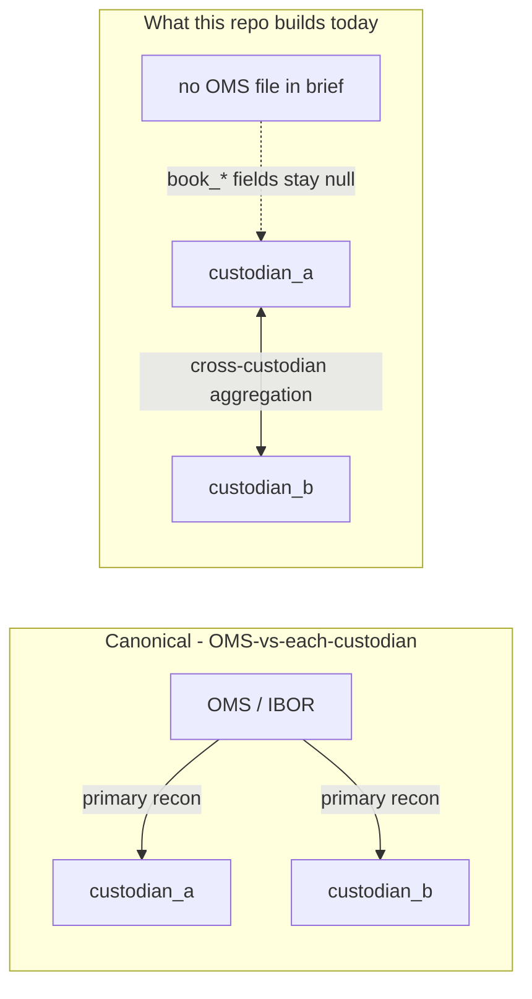
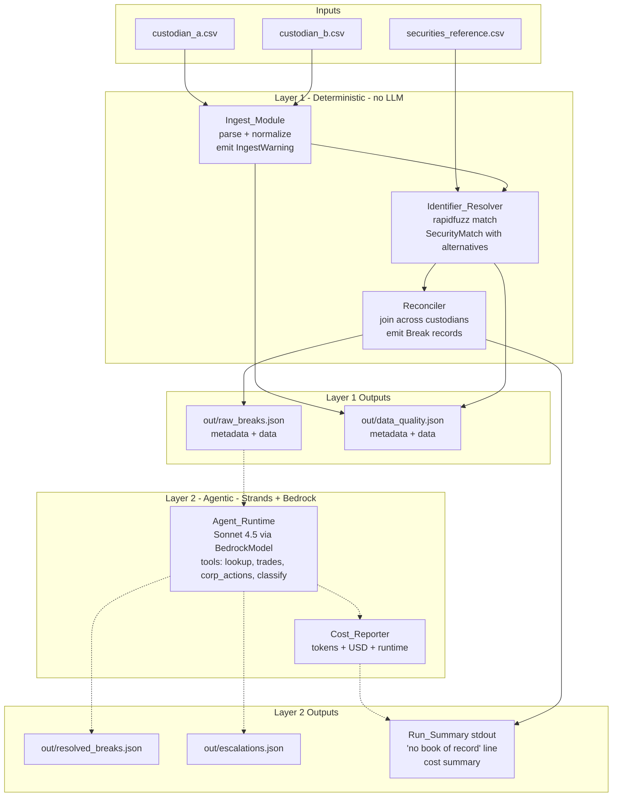
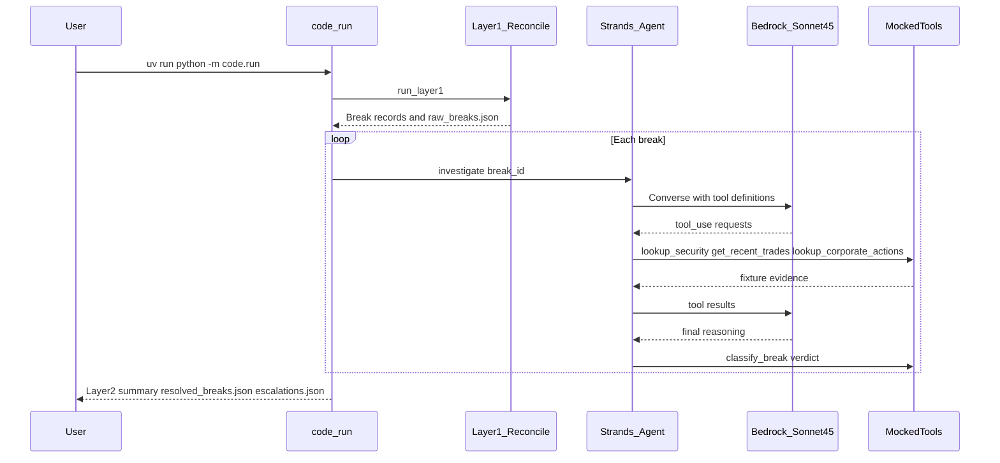

# Grayscale Technical Case Study — Securities Reconciliation

A two-layer reconciliation pipeline for the small-fund EOD positions problem in [Instructions.md](Instructions.md). Layer 1 is deterministic (no LLM) and produces a canonical break ledger. Layer 2 is an optional Strands + Bedrock Claude Sonnet 4.5 agent that investigates each break with mocked OMS / corp-actions tools and emits resolution and escalation artifacts.

## Strategic goal

The brief asks how to **completely eliminate** morning recon as a manual fire drill. The credible end game is **not** zero breaks forever — it is:

1. **Eliminate structural causes** — standard identifiers (FIGI/ISIN/CUSIP), real-time custodian feeds, straight-through processing — so break volume falls by orders of magnitude.
2. **Manage the residual** — settlement timing edge cases, corp-action misses, custodian errors — via agentic exception handling with human gates, eval harnesses, and a provably falling break rate over time.

**Near term:** automate today's EOD CSV workflow (~6 months, lower risk). **Long term:** eliminate the problem class (multi-year program: custodian standards, streaming positions, STP), with the AWS production architecture in [architecture/production_design.md](architecture/production_design.md). This repo proves both layers on the supplied fixtures — deterministic reconcile first, Bedrock agent on the exception queue second. Full framing in [§8](#8-honest-framing-of-eliminate) and the phased path in [§9](#9-phased-roadmap).

---

## 1. Summary

The fund's morning recon is two real problems wearing one label: **(a)** a deterministic data-shaping problem — different schemas, paren-negative shorts, four date formats, description-vs-ticker matching — and **(b)** an investigative problem — once a break is surfaced, ops has to pull trades, check the corp-action calendar, and decide whether to clear or escalate.

These deserve different tools. I built **(a)** as a deterministic Python pipeline (`code/pipeline/`) that emits a canonical `Break` record and a structured `IngestWarning` for every coercion. I built **(b)** as an optional Strands agent on Bedrock Claude Sonnet 4.5 (`code/agent.py` + `code/run.py`) that calls four `@tool`s and ends each turn with a verdict. See [Tenets of design](#tenets-of-design) for the rules that keep the two layers separated.

The same approach is also a phased roadmap: today's slice automates the symptom, the next two quarters tackle the structural causes (FIGI/ISIN/CUSIP, real-time feeds), and the agent owns the residual exceptions that no structural fix can eliminate.

## Tenets of design

Five rules that govern the design of this pipeline.

1. **Determinism before judgment** — Ingest, identifier resolution, and break detection belong in deterministic code. LLMs investigate exceptions only after the break ledger exists.

2. **Never silently rewrite source truth** — Every normalization is visible. When the data is ambiguous, the system surfaces the ambiguity instead of guessing.

3. **The agent recommends; it does not act** — The agent gathers evidence and proposes a verdict. It does not update books, move money, or mutate custodian data. Unclear outcomes go to a human.

4. **Every artifact must be auditable and reproducible** — Outputs carry provenance. Each break preserves what the custodian actually sent so ops can reconstruct and defend every decision.

5. **Production extends the demo, it does not replace it** — Production is how you host this laptop prototype at fund scale without rewriting it: the same Layer 1 pipeline and Layer 2 agent surface map onto managed AWS — custodian files in S3, Step Functions for ingest → reconcile → agent → human approval, Bedrock AgentCore for the Strands runtime with tools through AgentCore Gateway. Compliance and safety move into infrastructure — immutable audit storage, Guardrails, least-privilege access per step, and human-in-the-loop callbacks — so behavior at scale matches what the demo already proves.

The sections below show how these tenets appear in schema (§2), the fixture observations (§4), architecture (§5), and [production deployment](architecture/production_design.md).

## 2. Sub-problem 1: Data Representation

### The recon shape we built vs the canonical shape it generalizes to

Before getting into the schema, the recon-axis assumption needs to be explicit. The industry-canonical daily workflow is **OMS-vs-each-custodian**, not custodian-vs-custodian. Two flavors of that pattern dominate in practice:

- **Overlay Model (most firms):** the custodian file is treated as the "golden copy" and overlaid onto the OMS each morning. The OMS is the *investment book of record (IBOR)* — every trade is captured there at execution time — and the custodian's settled positions are the truth-check that catches OMS errors. The break ledger is the diff between the two. (Framing per [Ridgeline](https://www.ridgelineapps.com/resources/articles/a-single-book-of-record), [TorreBlanc](https://www.torreblanc.com/thought-leadership/to-persist-or-not).)
- **Self-Updating OMS Model:** the OMS maintains a continuous position ledger that reconciles autonomously throughout the day, with the custodian feed as confirmation rather than overlay (Bloomberg AIM-style). Smoother operationally; introduces single-vendor data-interpretation risk.

In either flavor the comparison axis is **OMS-vs-each-custodian**, not custodian-vs-custodian.

**What this brief shipped, and what we did with it.** The [Instructions.md](Instructions.md) text says *"reconciliation is the daily comparison between what the fund thinks it holds and what each custodian says it holds"* — OMS-vs-each-custodian language. But the supplied file set is two custodian CSVs plus a security master, with no OMS / book-of-record file. We took the only honest reading: do the custodian-vs-custodian aggregation against the files we have, surface the missing book of record as the first line of every run (`No book of record was supplied; reconciling custodian_a vs custodian_b only.`), and build the schema so an OMS file slots in without an architecture change.

**Where custodian-vs-custodian IS canonical — the Grayscale-relevant nuance.** Multi-prime hedge funds running across Goldman PB + Morgan Stanley PB (or, in the digital-asset world Grayscale lives in, Coinbase Custody + Anchorage + cold storage) absolutely do run cross-custodian position-by-position matching as a primary workflow — not a fallback. The [Finantrix multi-prime guide](https://www.finantrix.com/articles/how-to-build-a-prime-broker-reconciliation-workflow-for-multiple-brokers) names this pattern explicitly: *"position-by-position matching across all counterparties to identify common breaks such as settlement date differences, unsettled trades missing in one feed, and shorts vs. longs mis-tagging"*; AIMA's T+1 paper calls it *"multi-party reconciliation."* So while this repo's shape is a degraded form of the canonical OMS-vs-custodian workflow, it is also the literal shape of a real production workflow for the firm type Grayscale is closest to. Two readings, one implementation.




**Why the schema scales without a rewrite.** The `Break` model in the dump below already has `book_quantity`, `book_market_value`, and `position_type_book` declared as nullable. Adding an OMS feed populates those fields and the Reconciler grows from a two-side comparison to a three-side comparison — no schema migration, no `OutputArtifact` envelope change, no test rewrites. The Layer 1 firewall and the existing `{metadata, data}` envelope stay intact; the only new code is an `ingest_oms()` helper in [code/pipeline/ingest.py](code/pipeline/ingest.py) and one branch in [code/pipeline/reconcile.py](code/pipeline/reconcile.py) that compares each custodian side against the OMS first, then against the other custodian as a cross-check.

### The canonical Break record

Sub-problem 1 is "represent and process the data so downstream analysis is straightforward." The pipeline emits a canonical `Break` record, defined in [code/models.py](code/models.py) as a frozen Pydantic v2 model:

```python
class Break(BaseModel):
    break_id: str                # sha256(as_of|security_id|custodian)[:12]
    as_of_date: date
    security_id: str | None      # None when identifier_ambiguous
    custodian: Literal["custodian_a", "custodian_b", "both"]
    break_type: Literal[
        "missing_in_book", "missing_at_custodian",
        "quantity_mismatch", "value_mismatch",
        "position_type_mismatch",
        "identifier_unresolved", "identifier_ambiguous",
    ]
    book_quantity: int | None             # always None today (no book of record)
    custodian_quantity: int | None
    quantity_delta: int | None
    book_market_value: float | None
    custodian_market_value: float | None
    value_delta: float | None
    position_type_book: Literal["LONG", "SHORT"] | None
    position_type_custodian: Literal["LONG", "SHORT"] | None
    raw_source_row: dict[str, str]
    ingest_warnings: list[IngestWarning]
```

Three deliberate choices in this shape:

1. **`book_*` fields are nullable from day one.** The case-study brief has no book of record, but the schema can absorb one without migration. Today every `book_*` field is `None`; tomorrow an OMS feed populates them and the `Break` record gets richer without code changes.
2. **`position_type_*` AND `quantity_*` are both populated on a `position_type_mismatch`.** NVDA flips direction *and* moves size; we keep both signals on the same record so reviewers do not lose the delta when the headline is "the sides disagree on direction." See `code/pipeline/reconcile.py:reconcile()` step 4.4a.
3. **`raw_source_row` is always preserved.** Every Break carries the original CSV row that produced it, plus the per-row `IngestWarning` list. The audit trail is self-contained — no joins required to reconstruct what the custodian actually sent.

### Sample Break record — NVDA `position_type_mismatch`

This single record shows the dual `position_type_*` + `quantity_*` population, the nulled book-of-record fields, and the rich `ingest_warnings` trail attached from both source rows:

```json
{
  "break_id": "aec7ad406e95",
  "as_of_date": "2026-01-02",
  "security_id": "SEC0003",
  "custodian": "both",
  "break_type": "position_type_mismatch",
  "book_quantity": null,
  "custodian_quantity": 10000,
  "quantity_delta": 15000,
  "book_market_value": null,
  "custodian_market_value": 8500000.0,
  "position_type_book": null,
  "position_type_custodian": "LONG",
  "raw_source_row": { "symbol": "NVDA", "quantity": "10000", ... },
  "ingest_warnings": [
    {"type": "non_iso_date_coerced", "source_file": "custodian_a.csv", ...},
    {"type": "year_mismatch",         "source_file": "custodian_a.csv", ...},
    {"type": "paren_negative_coerced","source_file": "custodian_b.csv", ...},
    {"type": "non_iso_date_coerced", "source_file": "custodian_b.csv", ...},
    {"type": "year_mismatch",         "source_file": "custodian_b.csv", ...}
  ]
}
```

### Identifier resolution strategy

`code/tools/securities.py:IdentifierResolver` builds two indexes from the master once per run: a lowercase **dot-preserving** ticker map and a `rapidfuzz` WRatio index over lowercase names. Resolution is a three-branch algorithm:

1. **Exact ticker** (Custodian A): `BRK.A` → lowercased to `brk.a` → SEC0009. Dot survives because the security master is keyed on it.
2. **Fuzzy name** (Custodian B): `"Apple Inc Common Stock"` → WRatio against the master → SEC0001 if top confidence e `FUZZY_THRESHOLD = 0.85`.
3. **Ambiguous** when the top two candidates are within `AMBIGUITY_EPSILON = 0.05`. The resolver returns `security_id=None` and both candidates as `alternatives`. The Reconciler then emits `identifier_ambiguous` — a Break that a human or the Layer-2 agent can disambiguate.

The same `IdentifierResolver` is wrapped as the `lookup_security` `@tool` for the agent, so Layer 1 and Layer 2 always agree on the master.

### Every coercion is a typed warning

The ingest layer never silently rewrites data. Every paren-negative, every non-ISO date, every year mismatch, every preserved ticker dot generates an `IngestWarning` with a closed `Literal` type, a source file, and a row index. The full warning ledger lives in [out/data_quality.json](out/data_quality.json) inside the same `{metadata, data}` envelope as the break ledger — actual counts from the run:

| `IngestWarning.type` | Count |
|---|---|
| `year_mismatch` | 20 |
| `non_iso_date_coerced` | 19 |
| `paren_negative_coerced` | 4 |
| `ticker_dot_preserved` | 1 |
| **Total** | **44** |

## 3. Open Questions for the Business

**Operating context**
- Daily break volume and ops headcount? (Sizes the business case and the auto-clear value.)
- SLA between custodian file arrival and market open?
- Book of record — OMS or PMS? Read API or file drop?
- Which custodians? Goldman PB, BNY, State Street, IBKR, Coinbase Custody all have very different integration paths.
- Asset classes in scope? Equities here; derivatives, FX, fixed income, **crypto** are different problems.
- Multi-entity, multi-currency, multi-fund?

**Break composition**
- Today's mix: roughly what % settlement timing vs. corp action vs. FX vs. custodian error vs. data formatting?
- What do "cleared" and "understood-but-not-cleared" look like operationally — ticket system? audit trail?

**Risk and compliance**
- SEC 17a-4? SOC 2? Retention requirements?
- Dollar and confidence thresholds for auto-clear? Both must bind.
- Human-in-the-loop surface — Slack, ServiceNow, email?

**Strategic** (see [Strategic goal](#strategic-goal) at the top for the automate-vs-eliminate fork)
- Budget envelope and recurring run cost ceiling?

## Repository Layout

Brief map of the repo (inputs, code, generated artifacts, diagrams) before the file-specific observations in section 4.

```text
grayscale-project/
  README.md                    # This writeup: analysis, architecture, how to run
  Instructions.md              # Original case-study brief and deliverables
  pyproject.toml               # Project metadata and dependencies (uv)
  uv.lock                      # Locked dependency versions
  custodian_a.csv              # Input: ticker-based EOD positions (Custodian A)
  custodian_b.csv              # Input: description-based EOD positions (Custodian B)
  securities_reference.csv     # Canonical security master (20 equities)
  code/
    models.py                  # Pydantic models: Break, IngestWarning, OutputArtifact
    pipeline/
      ingest.py                # Layer 1: parse and normalize custodian CSVs
      reconcile.py             # Layer 1: cross-custodian join and break detection
    tools/
      securities.py            # Identifier resolver (+ Layer 2 lookup_security tool)
      trades.py                # Mocked recent-trades blotter (@tool)
      corporate_actions.py     # Mocked corp-action calendar (@tool)
      classification.py        # Agent verdict capture (@tool)
    agent.py                   # Layer 2: Strands agent on Bedrock Claude Sonnet 4.5
    run.py                     # Entrypoint: Layer 1 + Layer 2 + cost summary
    tests/                     # Acceptance tests for ingest, reconcile, resolver
  out/                         # Generated artifacts (JSON gitignored; sampleout.txt kept)
    raw_breaks.json            # Layer 1 break ledger
    data_quality.json          # Layer 1 ingest-warning ledger
    sampleout.txt              # Example terminal log (Layer 1 + partial Layer 2)
    resolved_breaks.json       # Layer 2 auto-cleared / investigated verdicts
    escalations.json           # Layer 2 breaks requiring human review
  architecture/
    low_level_architecture.mmd   # Mermaid source for section 5 demo diagram
    low_level_architecture.png   # Static export of section 5 demo diagram
    production_design.md       # Production AWS deployment (S3, Step Functions, AgentCore, DynamoDB)
```

## 4. Specific Observations from the Provided Files

Run output backs every number below. Counts come from [out/data_quality.json](out/data_quality.json) and [out/raw_breaks.json](out/raw_breaks.json) after `uv run python -m code.pipeline.reconcile`.

### Data quality / formatting

- **Date year discrepancy is real and unanimous.** The brief says positions are EOD for Jan 2, **2026**, but every row in both custodian files shows year **2025**. The ingest layer preserves source truth (the parsed date stays 2025) and emits a `year_mismatch` warning for each row. **20 such warnings** are present — every single row, both custodians. Either the brief has a typo or it is a deliberate signal; either way the pipeline never silently rewrites the year.
- **Custodian B encodes shorts as parenthesized negatives.** NVDA, BRK.A market values and shares show `(5000)`, `(4250000)`, `(10)`, `(6500000)`. The ingest layer coerces these to signed integers and emits **4 `paren_negative_coerced` warnings** (2 rows × 2 numeric fields).
- **Custodian B mixes four date formats.** `01/02/2025`, `1/2/25`, `2025-01-02`, `02-JAN-2025` — all present in a 10-row file. The ingest layer accepts every variant and emits **19 `non_iso_date_coerced` warnings**, one per non-ISO row across both custodians.
- **`BRK.A`'s period must be preserved.** Stripping the dot turns the ticker into `BRKA`, which has no master entry — that would silently produce a `missing_at_custodian` break for the wrong reason. The ingest layer emits a **`ticker_dot_preserved` warning** for the row and keeps the period verbatim. There is exactly 1 such warning, which is correct for this fixture.
- **Custodian A's column is mis-named.** `trade_date` for an EOD position file is really an `as_of_date`. The pipeline labels it correctly in the `Position` model regardless.

### Identification ambiguity

- **"Alphabet Inc"** in Custodian B is ambiguous between SEC0004 (`GOOGL`, Class A) and SEC0005 (`GOOG`, Class C). Fuzzy string match alone cannot disambiguate share classes — both score above `FUZZY_THRESHOLD` and are within `AMBIGUITY_EPSILON` of each other. The resolver refuses to pick a winner; the Reconciler emits one `identifier_ambiguous` Break with both candidates in `alternatives`.
- **"Berkshire Hathaway Class A Inc"** trips the same ambiguity branch — it scores nearly identically against SEC0009 (`BRK.A`) and SEC0010 (`BRK.B`). This is the borderline case predicted in [.kiro/specs/recon-demo-thought-leadership-hooks/tasks.md](../.kiro/specs/recon-demo-thought-leadership-hooks/tasks.md) task 16. **Asterisk on the expected ledger:** the spec predicted BRK.A would appear as `position_type_mismatch`; the implementation reports it as `missing_at_custodian` on the A-side + `identifier_ambiguous` on the B-side, for **15 breaks total instead of 14**. This is the resolver behaving correctly — the right fix is FIGI/ISIN, not lowering the epsilon and pretending the ambiguity does not exist.

### Position-level anomalies (observed in the run)

| Security | Observation | Break type |
|---|---|---|
| NVDA | 10,000 LONG at A / -5,000 SHORT at B | `position_type_mismatch` (delta 15,000) |
| BRK.A | 30 LONG at A / B-side ambiguous | `missing_at_custodian` + `identifier_ambiguous` |
| AAPL | 75,000 / 25,000 | `quantity_mismatch` (delta 50,000) |
| AMZN | 15,000 / 4,000 | `quantity_mismatch` (delta 11,000, ~73% proportional) |
| MSFT | 18,000 / 15,000 | `quantity_mismatch` |
| V | 5,000 / 3,000 | `quantity_mismatch` |
| META, TSLA, JPM, GOOGL | Only at A | `missing_at_custodian` (B-side absent) |
| BAC, SHOP, MA | Only at B | `missing_at_custodian` (A-side absent) |

Without a book of record these cannot be classified as sleeve splits vs. real breaks. **That is the point of the recon — to surface, not to decide.**

## 5. Sub-problem 2: Architecture

Three layers. Only the first two ship in this repo; the third is roadmap.



Static export: [architecture/low_level_architecture.png](architecture/low_level_architecture.png). Solid edges are the deterministic Layer-1 path; dotted edges are the optional Layer-2 agent path.

### Layer 1 — deterministic, the daily-driver

- **Entrypoint:** `uv run python -m code.pipeline.reconcile`
- **Outputs:** `out/raw_breaks.json`, `out/data_quality.json`
- **Hard rule:** no module in `code/pipeline/`, `code/models.py`, `code/tools/securities.py`, or `code/tests/` may import from `code/agent.py` or `strands*`. This firewall is what lets reviewers without Bedrock access still get a working pipeline.
- Every artifact ships inside an `OutputArtifact` envelope: `{metadata, data}` with `ruleset_version`, `code_commit` (git short SHA or `"uncommitted"`), `input_file_sha256s`, `as_of_date`, `generated_at`. Reproducibility is checkable from the file alone.

### Layer 2 — agentic, for break investigation

- **Entrypoint:** `uv run python -m code.run` (runs Layer 1 first, then attempts the agent)
- **Outputs:** `out/resolved_breaks.json`, `out/escalations.json`, plus a cost summary on stdout
- **Model:** Claude Sonnet 4.5 on Bedrock in `us-west-2` (`us.anthropic.claude-sonnet-4-5-20250929-v1:0`)
- **Tools (`@tool` decorator):**
  - `lookup_security` — wraps the Layer-1 resolver in [code/tools/securities.py](code/tools/securities.py); not duplicated, so Layer 1 and Layer 2 can never disagree about the master.
  - `get_recent_trades` — mocked OMS blotter in [code/tools/trades.py](code/tools/trades.py); covers SEC0001 / SEC0002 / SEC0006 / SEC0012 (quantity_mismatch settlement-timing stories), SEC0008 / SEC0011 (short SELL_SHORT pending T+1), and SEC0013 / SEC0015 (TRANSFER_IN from a prior custodian).
  - `lookup_corporate_actions` — mocked vendor calendar in [code/tools/corporate_actions.py](code/tools/corporate_actions.py); covers SEC0007 META (special dividend on the recon date) and SEC0014 BAC (merger consideration effective on the recon date).
  - `classify_break` — factory-built per break in [code/tools/classification.py](code/tools/classification.py) and bound to a per-call captured-verdict list. The runner reads the agent's final verdict directly from that list; the synthetic `escalate` default fires only when the agent failed to invoke the tool at all (safety fallback, not the primary path).
- **Graceful degradation:** Bedrock auth/transport failure is caught narrowly; the run prints the Layer-1-only summary and exits zero. The "no book of record" line prints in both modes.

Verified in the dev sandbox without AWS credentials:

```text
$ unset AWS_PROFILE AWS_ACCESS_KEY_ID && uv run python -m code.run
No book of record was supplied; reconciling custodian_a vs custodian_b only.
...
Layer 2 unavailable (NoCredentialsError: Unable to locate credentials); running Layer-1-only.
```

### Expected verdict distribution (Layer 2 against this dataset)

The mocked tool data plus the §11 auto-clear policy produce a real triage outcome rather than "everything escalates":

| Verdict | Count | Securities |
|---|---|---|
| `auto_clear` | 4-5 | AAPL, MSFT, AMZN, V, TSLA (clean settlement-timing stories) |
| `investigate` | 2-3 | META (corp-action + custodian gap), MA, SHOP (transfer-in stories ops should eyeball once) |
| `escalate` | 6-8 | NVDA (position-type flip, never auto-clearable per §11), BRK.A (B-side ambiguous), GOOGL (no plausible evidence), JPM (judgement call on the short), BAC (merger needs human), 2 identifier_ambiguous rows |

Exact split depends on what Claude decides on each run; the *shape* is what changed from a prior "everything escalates" behavior (the verdict-capture bug in `_extract_classification` is fixed; see `_default_escalate` in [code/agent.py](code/agent.py) for the safety fallback). `out/resolved_breaks.json` and `out/escalations.json` are the source of truth.

### Layer 3 — production architecture (roadmap)

Production lifts the same two-layer design into a fully managed, event-driven AWS stack: S3 ingestion, Lambda for the existing pipeline modules, Step Functions for orchestration, DynamoDB for break state, Bedrock AgentCore for the agent and Gateway-backed tools, plus EventBridge/SNS for escalations. The demo’s `code/run.py` Layer-1-only fallback still applies if Bedrock is unavailable — ops get breaks and data-quality artifacts even when the agent path is down.

**Full design:** [architecture/production_design.md](architecture/production_design.md) — components, data flow, security/compliance, cost model, and service choices (Step Functions vs Airflow, Lambda vs Glue, AgentCore vs self-hosted Strands).

## 6. Where AI Fits — and Where It Doesn't

The line is sharp and load-bearing:

- **Layer 1 is deterministic. It MUST NOT call an LLM.** Reconciling that 10,000 != -5,000 does not need a language model — it needs subtraction and a clear schema. Putting an LLM on that path adds latency, cost, an audit-trail headache, and a non-zero probability of arithmetic errors. The Layer-1 firewall makes the boundary mechanical, not aspirational.
- **Layer 2 is where AI earns its seat.** Explaining *why* AAPL is off by 50,000 shares is the judgement-heavy job — pull the trade blotter, check settlement state, check corp actions, narrate a verdict with cited evidence. Classical software is bad at this; LLMs are good at it; and the audit trail (every tool call + every model response) is exactly the same shape regulators want anyway.
- **State changes stay out of the tool surface.** `update_book`, `move_position`, `process_payment` are not tools. The agent *recommends*; the system-of-record *acts*. Enforce at the tool boundary, not in the prompt.

The strongest version of the demo is the Layer 1 / Layer 2 contrast, not the agent in isolation.

## 7. Pivots and Rejected Alternatives

The brief explicitly invites a "considered and rejected" narrative. Each below shows up in the architecture decisions above:

- **RPA (UI automation over the existing manual process)** — automates the symptom, not the cause; brittle to custodian portal changes; doesn't shrink the break population.
- **Pure rules engine for classification** — handles known break types but fails on novel ones; ops still trace anything new. The agent generalizes; the rules engine doesn't.
- **Fully autonomous agent that mutates the book** — unacceptable risk surface for a financial system. Our agent recommends and audits only; state-changing actions require human approval at the tool boundary.
- **OpenAI / multi-provider model layer** — considered for reviewer convenience; rejected to keep the AWS architecture story coherent end-to-end. Strands `BedrockModel` would make a swap trivial later if needed.
- **Polars over pandas for Layer 1** — faster on large datasets but irrelevant at this scale (~1020 rows). Reviewer familiarity wins. Keep it as a scaling option.
- **Custom ML classifier instead of an LLM agent** — viable for break categorization, but the *explanation* of a break is as valuable as the category, and LLMs produce both with the same call. Pivoted to LLM agent for that reason.
- **DynamoDB / S3 / Step Functions in the demo** — over-engineering for a 2-hour deliverable. Local files in the demo; cloud in the production stack.

## 8. Honest Framing of "Eliminate"

The [strategic goal](#strategic-goal) above states the end game in one place; this section defends it. A credible answer doesn't promise zero breaks.

Structural fixes drive **break volume** down by orders of magnitude:
- **Standard identifiers.** FIGI / ISIN / CUSIP at the source kills every `identifier_ambiguous` break — both "Alphabet Inc" and "Berkshire Hathaway Class A Inc" in this dataset disappear.
- **Real-time position feeds.** Replacing EOD CSV drops with streaming custodian APIs collapses the settlement-timing class of breaks.
- **Straight-through processing (STP).** Trades booked at the OMS flow to the custodian without manual rekeying; format and direction errors stop being a thing.

But corporate actions get mis-applied, custodians have outages, settlement has edge cases, and humans will always find new ways to enter the wrong number. Those **residual exceptions** are exactly what the Layer-2 agent owns. The right claim is: *eliminate the structural causes, manage the residual via agentic exception handling, and prove it with a falling break rate over time.* Not "drive it to zero."

## 9. Phased Roadmap

The 18-month row (DynamoDB, Step Functions, streaming feeds) is specified in [architecture/production_design.md](architecture/production_design.md).

| Horizon | Investment | What ships | Break-volume target |
|---|---|---|---|
| **Today (this repo)** | One engineer, ~2 days | Layer 1 + Layer 2 prototype on laptops; mocked tools; demo-grade artifacts | N/A — proof of concept |
| **6 months** | Small team | Layer 1 in CI; `get_recent_trades` and `lookup_corporate_actions` hit real internal APIs; `classify_break` runs against a labeled eval set; Bedrock AgentCore hosting; Slack approval flow | 50% reduction in human-touched breaks |
| **18 months** | Joint with custodian-relations | FIGI/ISIN/CUSIP master; streaming feeds from top-2 custodians; STP for in-house trades; DynamoDB + Step Functions production stack | 90%+ reduction in break volume |
| **3 years** | Joint with industry | Standard identifiers + real-time across all custodians; agent handles only the long-tail exceptions; eval-driven auto-clear thresholds tuned per asset class | Residual-only; agent owns 100% of remaining exceptions |

Eliminate is a program, not a sprint.

## 10. Cost Framing

Layer 1 is **free** at the margin — milliseconds of CPU per run (`runtime_seconds=0.019` on this dataset).

Layer 2 uses Claude Sonnet 4.5 on Bedrock at the rates baked into `code/run.py`:

```python
# USD per million tokens → Bedrock on-demand pricing, Claude Sonnet 4.5 (us-west-2)
# https://aws.amazon.com/bedrock/pricing/
INPUT_RATE  = 3.00
OUTPUT_RATE = 15.00
```

For this dataset (15 breaks), a conservative per-break envelope of ~2,000 input + ~500 output tokens puts a single run at:

> `15 breaks → (2_000 → $3 + 500 → $15) / 1_000_000 = 15 → ($0.006 + $0.0075) = $0.20 / run`

Even at 10× the token budget for richer evidence-gathering the run is well under a dollar. Per day across all funds: still budget dust. Per *year* with 250 trading days and a 10— funds growth: low four figures of LLM cost for an ops-team-month of work avoided.

The `RunSummary` printer reports exact per-run cost as `estimated_cost_usd`; the metric should flow into CloudWatch as a custom dimension in production so a cost ceiling can be alarmed (Trust & Safety §11).

## 11. Trust, Safety, and Evaluation

Non-negotiables before any of this touches real positions:

- **Bedrock Guardrails** configured before first deploy (PII redaction, denied topics, prompt-injection defense).
- **Evaluation harness** against labeled historical breaks (Strands Evals SDK). No auto-clear until precision/recall meets a documented bar per break type.
- **Human-in-the-loop** with both a confidence threshold *and* a dollar threshold. Auto-clear only when both are below limit. Anything above either threshold routes to a human (Slack approval card in 6-month plan; ServiceNow ticket as the durable surface).
- **Immutable audit trail** — every input, every tool call, every model response, every confidence score, every human action. DynamoDB Streams → S3 with object lock. Meets SEC 17a-4 retention.
- **Cost ceiling** per session and per daily run, enforced and alarmed.
- **Determinism where possible** — the Layer-1 firewall in this repo is a load-bearing version of this principle.

### Eval contract

The bullets above promise an evaluation harness before auto-clear ever runs. That promise is empty without a contract. This subsection defines the contract — the *schema*, the *metric*, and the *bar* — so the harness becomes a build task in the 6-month roadmap rather than a research project.

**Labeled-break schema.** A graded break is the `Break` record plus a human ground-truth verdict and minimal provenance:

```python
class LabeledBreak(BaseModel):
    break_id: str                          # links back to the Break record
    break_snapshot: Break                  # full Break payload at label time
    truth_verdict: Literal["auto_clear", "investigate", "escalate"]
    truth_root_cause: Literal[
        "settlement_timing", "corporate_action", "fx",
        "custodian_error", "data_quality", "real_difference",
        "identifier_ambiguity",
    ]
    truth_dollar_impact: float             # signed USD; positive = position over-stated at custodian
    labeled_by: str                        # ops analyst identifier
    labeled_at: datetime
    notes: str | None
```

Two non-obvious choices here: `break_snapshot` carries the *full* `Break` payload at the moment the label was applied — that way a future schema evolution doesn't invalidate the label, because the eval replay uses the snapshot, not a re-derived record. And `truth_root_cause` is a closed `Literal`, not free text, so per-category precision is computable without LLM-on-LLM grading.

**Metric — three numbers per release, computed per `break_type` and per `truth_root_cause`.**

- **`precision_auto_clear`** = `correct_auto_clears / total_agent_auto_clears`. The *safety* number. False positives here are the regulatory risk — the agent auto-cleared a break that was actually a real difference and ops never saw it.
- **`recall_escalate`** = `agent_escalations_on_true_escalates / total_true_escalates`. The *capture* number. False negatives here are the breaks that should have hit a human and didn't.
- **`dollar_weighted_precision`** = `sum(dollar_impact of correct auto-clears) / sum(dollar_impact of all agent auto-clears)`. Catches the case where the agent is right on the small breaks and wrong on the big ones — a 95% raw precision can still be a 60% dollar-weighted precision if the misses cluster on the high-impact breaks.

All three are cheap to compute from a `LabeledBreak` set; no instrumentation is needed beyond what the agent already emits to `out/resolved_breaks.json`.

**The bar — the actual auto-clear policy, written so ops, compliance, and engineering all read it the same way.**

| `break_type` | `precision_auto_clear` floor | `dollar_weighted_precision` floor | Per-break dollar ceiling |
|---|---|---|---|
| `quantity_mismatch` | 0.99 | 0.99 | $10,000 |
| `value_mismatch` | 0.99 | 0.99 | $10,000 |
| `position_type_mismatch` | 1.00 | 1.00 | $0 (always escalate) |
| `missing_at_custodian` | 0.995 | 0.99 | $25,000 |
| `identifier_ambiguous` | 1.00 | 1.00 | $0 (always escalate) |

Two policy choices to defend: (1) `position_type_mismatch` and `identifier_ambiguous` are *never* auto-clearable — a direction flip and an unresolved identifier are categorically the wrong place for the agent to act, regardless of confidence. (2) The dollar ceilings above are deliberately conservative for the pilot; they ratchet up only after a documented N consecutive eval runs at the precision floor per `break_type`. No silent threshold creep.

**How the harness wires in (sketch — not built).** `code/eval/` holds a `LabeledBreak[]` JSON corpus (initial size ~50 records seeded from historical breaks; grows monotonically as ops grades real production breaks), a `run_eval.py` that replays each labeled snapshot through the Layer-2 agent with deterministic-mode prompting (`temperature=0`, fixed seed), and a `report.py` that writes a CSV per release with the three metrics → every `break_type` → every `truth_root_cause`. A single GitHub Actions job invokes the harness on every PR that touches `code/agent.py`, `code/tools/`, the system prompt, or the pinned model id, and the job fails if any cell in the per-release CSV is below the bar above — *no model change, no prompt change, no tool change ships without passing*. This is the gating mechanism referenced in the §9 6-month roadmap row, not a separate program.

The agent's `escalate` verdict is the safe default. Any break with no classification, low confidence, or a tool-call failure falls into `out/escalations.json` rather than `out/resolved_breaks.json`.

## How to Run

```bash
# Sync the env (uv handles the Python toolchain)
uv sync

# Layer 1 only (no AWS credentials needed)
uv run python -m code.pipeline.reconcile

# Layer 1 + Layer 2 (requires Bedrock access in us-west-2; degrades gracefully if missing)
uv run python -m code.run

# Tests
uv run pytest

# Lint + format
uv run ruff check .
uv run ruff format --check .
```

## AWS setup for Layer 2

Layer 2 calls **Amazon Bedrock** from your laptop via the Strands SDK. It does **not** deploy AgentCore, VPC endpoints, DynamoDB, S3, or real OMS/corp-action APIs (those tools return local JSON fixtures).

### What you need

| Requirement | Value |
|---|---|
| **Region** | `us-west-2` (hardcoded in [`code/agent.py`](code/agent.py)) |
| **Model** | Claude Sonnet 4.5 inference profile: `us.anthropic.claude-sonnet-4-5-20250929-v1:0` |
| **Credentials** | Standard AWS chain (`aws configure`, env vars, or SSO profile) |
| **IAM** | `bedrock:InvokeModel` and `bedrock:InvokeModelWithResponseStream` on the model/inference profile (sandbox: `AmazonBedrockFullAccess`) |

### Step-by-step

1. **Install AWS CLI v2** → [Getting started with the AWS CLI](https://docs.aws.amazon.com/cli/latest/userguide/getting-started-install.html).

2. **Configure credentials** (choose one):

   **Access keys**

   ```bash
   aws configure
   # Default region name: us-west-2
   ```

   **SSO**

   ```bash
   aws configure sso
   aws sso login --profile your-profile
   export AWS_PROFILE=your-profile
   export AWS_DEFAULT_REGION=us-west-2
   ```

3. **Enable model access** → AWS Console → **Amazon Bedrock** ? region **US West (Oregon)** → **Model access** (or model catalog) ? enable **Claude Sonnet 4.5** (`anthropic.claude-sonnet-4-5-20250929-v1:0`). Some accounts require a one-time access request.

4. **Verify** before running the agent:

   ```bash
   aws sts get-caller-identity --region us-west-2 --no-cli-pager
   aws bedrock list-foundation-models --region us-west-2 --by-provider anthropic --no-cli-pager | grep sonnet-4-5
   ```

5. **Run the full pipeline** from the repo root:

   ```bash
   uv sync --all-groups
   uv run python -m code.run
   ```

### Troubleshooting

| Symptom | Likely cause | Fix |
|---|---|---|
| `NoCredentialsError: Unable to locate credentials` | No profile or env vars | `aws configure` or `export AWS_PROFILE=...` after `aws sso login` |
| `ResourceNotFoundException` → model → **end of its life** | Retired model (e.g. Claude 3.7) | Use Sonnet 4.5 ID above; enable in Bedrock console |
| `AccessDeniedException` | IAM or model access | Grant Bedrock invoke permissions; enable model in console |
| Layer 1 completes, then `Layer 2 unavailable (...); running Layer-1-only.` | Any Bedrock/auth error | Expected fallback in [`code/run.py`](code/run.py); fix AWS and re-run |

The first run in [out/sampleout.txt](out/sampleout.txt) (line 29) shows the **EOL model** failure; the second run (line 30 onward) is after switching to Sonnet 4.5.

## How Layer 2 runs (agentic component)

`uv run python -m code.run` always runs **Layer 1 first**, then attempts Layer 2. Layer 1 writes `out/raw_breaks.json` and `out/data_quality.json`. Layer 2 reads the 15 `Break` records and invokes the agent **once per break** (~several minutes for the full dataset).



### Tools and verdict routing

| Tool | Source | Role |
|---|---|---|
| `lookup_security` | Real [`IdentifierResolver`](code/tools/securities.py) | Resolve ticker/description to `security_id` |
| `get_recent_trades` | Mocked [`code/fixtures/trades.json`](code/fixtures/trades.json) | Settlement-timing evidence |
| `lookup_corporate_actions` | Mocked [`code/fixtures/corporate_actions.json`](code/fixtures/corporate_actions.json) | Corp-action evidence |
| `classify_break` | [`code/tools/classification.py`](code/tools/classification.py) | Records `auto_clear`, `investigate`, or `escalate` |

| Verdict | Written to |
|---|---|
| `auto_clear`, `investigate` | `out/resolved_breaks.json` |
| `escalate` | `out/escalations.json` |

If the agent never calls `classify_break`, the runner synthesizes an `escalate` verdict (safety fallback in [`code/agent.py`](code/agent.py)).

### Example terminal output

Full captured session: **[out/sampleout.txt](out/sampleout.txt)** (truncated mid-run during break 6 of 15; a complete run finishes all breaks and prints the Layer 2 summary below).

**Layer 1** (always printed first):

```text
No book of record was supplied; reconciling custodian_a vs custodian_b only.
...
Summary:
  Total breaks: 15
  identifier_ambiguous: 2
  missing_at_custodian: 8
  position_type_mismatch: 1
  quantity_mismatch: 4
runtime_seconds=0.032
```

**ESCALATE → ambiguous identifier** (Alphabet; `lookup_security` cannot pick GOOGL vs GOOG):

```text
I'll investigate this identifier ambiguous break for Alphabet Inc...
Tool #1: lookup_security
...
Tool #2: classify_break
**Verdict: ESCALATE**
```

**AUTO_CLEAR → settlement timing** (AAPL quantity mismatch; pending T+1 trade explains delta):

```text
Tool #1: get_recent_trades
Tool #2: lookup_corporate_actions
Tool #3: classify_break
**Verdict:** AUTO_CLEAR
**Confidence:** 95%
```

**ESCALATE → position type mismatch** (NVDA LONG vs SHORT; not auto-clearable per §11 policy):

```text
Tool #3: classify_break
**Verdict: ESCALATE**
```

**Successful run tail** (not in sampleout; printed by [`code/run.py`](code/run.py) after all 15 breaks):

```text
--- Layer 2 (agent) summary ---
  auto_cleared_count: <n>
  escalated_count: <n>
  tokens_input: <n>
  tokens_output: <n>
  estimated_cost_usd: $0.xxxxxx
  layer2_runtime_seconds=...
```
