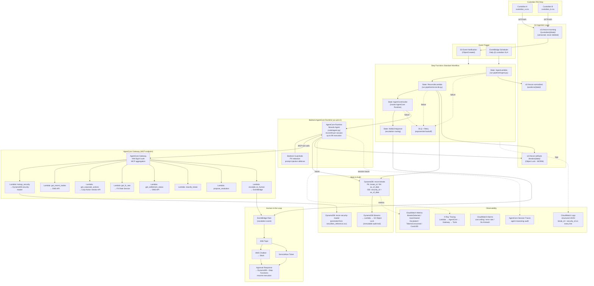

# Design Document: Recon Production AWS Deployment

## Overview

This document describes the production AWS architecture that lifts the custodian reconciliation demo from a local-file pipeline into a fully managed, event-driven cloud system. The demo's two-layer design — a deterministic Python pipeline (Layer 1) and a Strands Agents SDK agentic resolver (Layer 2) — maps cleanly onto AWS managed services: S3 event notifications trigger an AWS Lambda normalization step, AWS Step Functions orchestrate the end-to-end workflow, Amazon Bedrock AgentCore Runtime hosts the Strands agent with microVM session isolation and consumption-based pricing, and AgentCore Gateway exposes the `@tool` functions as MCP-compatible endpoints backed by real data sources. DynamoDB stores break state with single-digit-millisecond reads; S3 Object Lock provides the WORM audit trail required for SEC 17a-4 compliance; CloudWatch and X-Ray deliver end-to-end observability across every layer.


## Architecture




## Components and Interfaces

### S3 — Ingestion and Artifact Storage

Three purpose-separated buckets handle the file lifecycle:

| Bucket | Purpose | Key Config |
|---|---|---|
| `recon-incoming` | Raw custodian CSV drops | Versioning enabled; lifecycle rule archives to S3 Glacier after 90 days; never deleted |
| `recon-normalized` | Normalized position JSON emitted by IngestLambda | Standard storage; 30-day lifecycle to IA |
| `recon-artifacts` | Break records, resolved breaks, escalations | S3 Object Lock (COMPLIANCE mode, 7-year retention) for SEC 17a-4 WORM compliance |

S3 Event Notifications on `recon-incoming` fire an `ObjectCreated` event that triggers the Step Functions workflow. This replaces the demo's manual `uv run python -m code.run` invocation with a fully automated, file-arrival-driven pipeline.

**Rationale**: S3 is the natural landing zone for custodian file drops (SFTP, API push, or email-to-S3 via SES). Versioning ensures no raw file is ever lost. Object Lock on the artifacts bucket satisfies the immutable audit trail requirement without custom code — the WORM guarantee is enforced at the storage layer.

### AWS Lambda — Normalization and Tool Execution

Lambda functions host two distinct workloads:

**Pipeline Lambdas** (IngestLambda, ReconcileLambda): The existing `code/pipeline/ingest.py` and `code/pipeline/reconcile.py` logic runs inside Lambda functions triggered by Step Functions. Each function reads from S3, writes results to DynamoDB and S3, and emits structured CloudWatch logs. Memory: 512 MB; timeout: 5 minutes (well within the 15-minute Lambda limit for the current ~20-row dataset).

**Tool Lambdas** (one per `@tool` function): Each of the eight agent tools — `lookup_security`, `get_recent_trades`, `get_corporate_actions`, `get_settlement_status`, `get_fx_rate`, `classify_break`, `propose_resolution`, `escalate_to_human` — is deployed as a separate Lambda function registered as an AgentCore Gateway target. In production, these call real data sources (OMS API, corporate action vendor, FX rate service). In staging, they return fixture data identical to the demo's `code/fixtures/` JSON files.

**Rationale**: Lambda is the right choice for the normalization step. The transform is simple Python already written; the dataset is ~20 rows/day at current volume. Glue adds schema catalog overhead, a 10-minute minimum billing unit, and a Spark execution model that is overkill for this workload. Lambda cold starts are sub-second for a 512 MB Python function with no VPC attachment. See the Glue vs Lambda Decision section for the full analysis.

### AWS Step Functions — Workflow Orchestration

A Step Functions Standard Workflow orchestrates the five-state pipeline:

```
IngestLambda → ReconcileLambda → AgentCoreInvoke → NotifyOrApprove → Done
```

Each state is a Lambda invocation or direct SDK integration (AgentCore Runtime invoke). Step Functions provides:
- **Retry with exponential backoff** on each state (3 retries, base interval 2s, backoff rate 2.0)
- **Dead-letter queue** for runs that exhaust retries — ops team is alerted via CloudWatch Alarm
- **Human approval step** in `NotifyOrApprove`: when the agent emits escalations, Step Functions pauses execution and waits for a `SendTaskSuccess` callback from the approval surface (Slack or ServiceNow)
- **Execution history** retained for 90 days — every state transition, input, and output is auditable

A daily EventBridge Scheduler rule triggers the workflow at a configurable time after the custodian file SLA window (e.g., 06:00 UTC). The S3 event notification provides an additional trigger for same-day re-runs when a custodian re-drops a corrected file.

**Rationale**: Step Functions Standard Workflow (not Express) is required because the human approval callback can take hours. Express Workflows have a 5-minute maximum duration. Standard Workflows support the `.waitForTaskToken` pattern needed for HITL.

### Amazon Bedrock AgentCore Runtime — Agent Hosting

The Strands agent (`code/agent.py`) is deployed to AgentCore Runtime via direct code deployment (ZIP upload). Key properties:

- **microVM isolation per session**: each reconciliation run gets a dedicated microVM with isolated CPU, memory, and filesystem. Cross-session data contamination is structurally impossible.
- **Extended execution**: supports workloads up to 8 hours — well beyond the 15-minute Lambda limit that would otherwise constrain complex multi-break agent sessions.
- **Consumption-based pricing**: charges only for active processing time, not I/O wait. Since the agent spends most of its time waiting for Bedrock model responses, this is significantly cheaper than a provisioned container.
- **Built-in observability**: AgentCore session traces capture agent reasoning steps, tool invocations, and model interactions — the audit trail the compliance team needs.
- **Framework agnostic**: the existing Strands `Agent` + `BedrockModel` code deploys unchanged. No rewrite required.

The agent is configured with `BedrockModel(model_id="anthropic.claude-sonnet-4-20250514-v1:0", region_name="us-west-2")` and Bedrock Guardrails attached for PII redaction, denied topics, and prompt injection defense.

**Reference**: [AgentCore Runtime documentation](https://docs.aws.amazon.com/bedrock-agentcore/latest/devguide/agents-tools-runtime.html)

### Amazon Bedrock AgentCore Gateway — Tool Exposure

AgentCore Gateway provides a single MCP-compatible endpoint that aggregates all eight tool Lambdas into a unified virtual MCP server. The agent in AgentCore Runtime calls tools through the Gateway endpoint rather than invoking Lambda functions directly.

Key Gateway properties:
- **MCP aggregation mode**: the Gateway combines all Lambda targets into one `tools/list` response. The agent sees a single endpoint and a unified tool catalog.
- **IAM SigV4 authorization**: inbound calls from AgentCore Runtime are authenticated via AWS Signature Version 4. No API keys or OAuth tokens are needed for the agent-to-gateway leg.
- **Target-level auth**: each Lambda target uses the Gateway's execution role. For OpenAPI targets (OMS API, FX rate service), an AgentCore Credential Provider stores the API key or OAuth credentials.
- **Staging vs production**: the same Gateway configuration is used in both environments. In staging, the Lambda targets return fixture data. In production, they call real systems. The agent code is identical in both environments.

**Reference**: [AgentCore Gateway core concepts](https://docs.aws.amazon.com/bedrock-agentcore/latest/devguide/gateway-core-concepts.html)

### DynamoDB — Break State and Security Master

Two tables:

**`recon-breaks`**
- Partition key: `break_id` (stable SHA-256 hash of `as_of_date|security_id|custodian`)
- Sort key: `as_of_date`
- GSI: `security_id` + `as_of_date` for break history queries per security
- Stores: Break records (from ReconcileLambda), ResolvedBreak records (from AgentCore), human decisions (from approval callbacks)
- On-demand capacity mode — traffic is bursty (one daily run) and unpredictable
- KMS encryption at rest

**`recon-security-master`**
- Promoted from `securities_reference.csv`
- Updated via a separate pipeline when FIGI/ISIN/CUSIP master is integrated
- The `lookup_security` tool Lambda queries this table instead of a local CSV
- Single-digit-millisecond reads for the agent's identifier resolution calls

DynamoDB Streams on `recon-breaks` feed a Lambda that writes immutable records to `recon-artifacts` S3 with Object Lock. This provides the WORM audit trail without requiring the application to write to S3 directly on every state change.

### EventBridge + SNS — Human-in-the-Loop Notification

When the agent's `escalate_to_human` tool fires, it emits an EventBridge event. An EventBridge rule routes the event to an SNS topic. SNS fans out to:
- **AWS Chatbot → Slack**: ops team receives a structured Slack message with break details, agent reasoning, and an approval/reject button. The button posts back to an API Gateway endpoint that calls `SendTaskSuccess` on the Step Functions execution.
- **ServiceNow**: an SNS subscription creates a ServiceNow incident with the break record attached.

Dollar threshold and confidence threshold are both required for auto-clear. The agent only calls `escalate_to_human` when either threshold is not met — this is enforced at the tool boundary, not via prompting.

### CloudWatch + X-Ray — Observability

Every Lambda function and AgentCore Runtime session emits structured JSON logs with `break_id` and `security_id` on every line. Custom CloudWatch metrics are emitted per run:

| Metric | Description |
|---|---|
| `BreaksDetected` | Total breaks emitted by ReconcileLambda |
| `BreaksAutoCleared` | Breaks resolved by the agent without escalation |
| `BreaksEscalated` | Breaks routed to human review |
| `TokensConsumed` | Total Bedrock tokens used per run |
| `CostUSD` | Estimated Bedrock cost per run |

CloudWatch Alarms fire on: cost per run exceeding a ceiling, Lambda error rate above threshold, Step Functions execution failure, and SLA breach (workflow not completed by market open).

X-Ray traces span the full call chain: Step Functions → Lambda → AgentCore Runtime → Gateway → Tool Lambdas. AgentCore session traces provide the agent-specific reasoning audit.

### IAM and Security

- **Least-privilege roles per component**: IngestLambda has read access to `recon-incoming` and write access to `recon-normalized` only. ReconcileLambda has write access to DynamoDB `recon-breaks` and `recon-artifacts`. AgentCore Runtime has invoke access to the Gateway endpoint only.
- **No hardcoded credentials**: all secrets (OMS API key, FX rate service credentials) are stored in AWS Secrets Manager and injected as environment variables at Lambda invocation time.
- **Bedrock Guardrails**: attached to the AgentCore Runtime agent. Configured for PII redaction (position data may contain fund-identifying information), denied topics (no book mutations), and prompt injection defense.
- **VPC endpoints**: S3, DynamoDB, and Bedrock endpoints are configured so all traffic stays on the AWS private network. No data traverses the public internet.
- **KMS encryption**: all S3 buckets and DynamoDB tables use customer-managed KMS keys. Key rotation is enabled.


## Data Flow

Step-by-step from custodian file drop to resolved break:

1. **File arrival**: Custodian A or B drops an EOD CSV to `s3://recon-incoming/{custodian}/{date}/`. S3 versioning records the exact byte content. An `ObjectCreated` S3 Event Notification fires immediately.

2. **Workflow trigger**: The S3 notification triggers the Step Functions Standard Workflow execution. Alternatively, the daily EventBridge Scheduler rule triggers the workflow at the configured SLA window time (handles cases where the file arrived before the scheduler fired).

3. **Ingest (IngestLambda)**: The Lambda function runs `pipeline/ingest.py` logic. It reads the raw CSV from `recon-incoming`, applies all normalization rules (paren negatives, date coercion, ticker-dot preservation), emits `IngestWarning` records, and writes normalized position JSON to `recon-normalized`. Structured logs include `custodian`, `as_of_date`, and row counts.

4. **Reconcile (ReconcileLambda)**: The Lambda function runs `pipeline/reconcile.py` logic. It reads normalized positions from `recon-normalized`, queries `recon-security-master` DynamoDB for identifier resolution, performs the cross-custodian join, and emits `Break` records. Break records are written to DynamoDB `recon-breaks` and to `recon-artifacts` S3 (Object Lock). The `data_quality.json` artifact is also written to `recon-artifacts`.

5. **Agent invocation (AgentCoreInvoke)**: Step Functions invokes the AgentCore Runtime session with the list of `break_id` values from the current run. The Strands agent iterates over each break, calling tools through the AgentCore Gateway MCP endpoint. For each break, the agent calls `lookup_security`, then one or more of `get_recent_trades`, `get_corporate_actions`, `get_fx_rate`, `get_settlement_status` to gather evidence, then `classify_break` and `propose_resolution`. If confidence is below threshold or the dollar value exceeds the auto-clear limit, the agent calls `escalate_to_human`.

6. **Tool execution**: Each tool call from the agent hits the AgentCore Gateway endpoint (IAM SigV4 authenticated). The Gateway routes the call to the appropriate Lambda target. In production, `get_recent_trades` calls the OMS API; `get_corporate_actions` calls the corporate action vendor API; `get_fx_rate` calls the FX rate service. `lookup_security` queries DynamoDB `recon-security-master` directly.

7. **State persistence**: The agent writes `ResolvedBreak` and `Escalation` records to DynamoDB `recon-breaks` (updating the existing Break items). DynamoDB Streams picks up the changes and a downstream Lambda writes immutable copies to `recon-artifacts` S3 with Object Lock.

8. **Notification / HITL**: For escalated breaks, the `escalate_to_human` tool emits an EventBridge event. The EventBridge rule routes to SNS → Slack (via AWS Chatbot) and/or ServiceNow. The Step Functions execution pauses at the `NotifyOrApprove` state, waiting for a `SendTaskSuccess` callback. The ops team reviews the break in Slack or ServiceNow, approves or rejects, and the callback resumes the workflow.

9. **Completion**: The Step Functions execution completes. CloudWatch custom metrics are emitted for the run (`BreaksDetected`, `BreaksAutoCleared`, `BreaksEscalated`, `TokensConsumed`, `CostUSD`). A CloudWatch Alarm fires if the workflow did not complete before the market-open SLA.


## Glue vs Lambda Decision

**Decision: Lambda for the normalization step.**

| Criterion | AWS Glue ETL | AWS Lambda |
|---|---|---|
| Current dataset size | ~20 rows/day | ~20 rows/day |
| Transform complexity | Simple Python (already written) | Simple Python (already written) |
| Minimum billing unit | 10 minutes (DPU-hour) | 1 ms |
| Cold start | ~2 minutes (Spark cluster spin-up) | <1 second (512 MB Python) |
| Schema evolution | Built-in Data Catalog, Crawler | Manual schema management |
| Job bookmarks | Yes (deduplication across runs) | Must implement manually |
| Code reuse from demo | Requires Glue-specific PySpark wrapper | Direct reuse of `pipeline/ingest.py` |
| Operational overhead | Glue job definitions, IAM, triggers | Lambda function + IAM role |

**Verdict**: Lambda wins at current volume. The transform is already written as plain Python; wrapping it in a Glue PySpark job adds ~50 lines of boilerplate and a 10-minute minimum billing unit for a job that completes in under 5 seconds. The cold start difference alone (2 minutes vs <1 second) would breach the SLA window at low volume.

**When to revisit**: If daily volume exceeds ~10,000 rows, or if schema evolution becomes a recurring operational burden (multiple custodians with diverging schemas), migrate the normalization step to Glue. The Lambda function's interface (reads from S3, writes to S3/DynamoDB) is identical to what a Glue job would consume — the migration is a drop-in replacement at the Step Functions state level. Glue Data Catalog integration also becomes valuable when a FIGI/ISIN/CUSIP master is integrated, as the Crawler can track schema changes across custodian file formats automatically.


## AgentCore Runtime + Gateway Integration

### Agent Deployment

The Strands agent (`code/agent.py`) is deployed to AgentCore Runtime via direct code deployment:

1. Package `code/agent.py`, `code/models.py`, and `requirements.txt` into a ZIP archive.
2. Use the AgentCore CLI (`agentcore deploy --region us-west-2`) or the AWS SDK to create/update the Runtime agent.
3. The Runtime auto-patches the Python runtime and provisions microVMs on demand.


In production, the `@tool` functions are registered as AgentCore Gateway targets rather than being bundled with the agent. The agent calls them through the Gateway MCP endpoint. This separation means tool implementations can be updated independently of the agent code.

### Gateway Configuration

Each `@tool` function is registered as a Lambda target on the AgentCore Gateway:

```
Gateway: recon-tools-gateway
  Inbound auth: IAM SigV4
  Targets:
    - lookup_security      → Lambda: recon-tool-lookup-security
    - get_recent_trades    → Lambda: recon-tool-get-recent-trades
    - get_corporate_actions → Lambda: recon-tool-get-corporate-actions
    - get_settlement_status → Lambda: recon-tool-get-settlement-status
    - get_fx_rate          → Lambda: recon-tool-get-fx-rate
    - classify_break       → Lambda: recon-tool-classify-break
    - propose_resolution   → Lambda: recon-tool-propose-resolution
    - escalate_to_human    → Lambda: recon-tool-escalate-to-human
```

The Gateway aggregates all targets into a single virtual MCP server. The agent calls `tools/list` once at session start and receives all eight tools in a single response. Tool calls are routed by the Gateway to the appropriate Lambda.

### Staging vs Production Tool Behavior

The same Gateway configuration is used in both environments. Environment-specific behavior is controlled by Lambda environment variables:

| Environment variable | Staging value | Production value |
|---|---|---|
| `DATA_SOURCE` | `fixture` | `live` |
| `OMS_API_ENDPOINT` | (unused) | `https://oms.internal/api/v2` |
| `CORP_ACTION_API_ENDPOINT` | (unused) | `https://corpactions.vendor.com/api` |
| `FX_RATE_API_ENDPOINT` | (unused) | `https://fxrates.internal/api` |

When `DATA_SOURCE=fixture`, the tool Lambda reads from the same `code/fixtures/` JSON files used in the demo. When `DATA_SOURCE=live`, it calls the real system. The agent code and Gateway configuration are identical in both environments — only the Lambda environment variables differ.

### Session Lifecycle

Each Step Functions execution that invokes AgentCore creates one Runtime session. The session processes all breaks for that run (typically 10–20 breaks at current volume). The microVM is terminated after the session completes and memory is sanitized. Session traces are retained in CloudWatch for the configured retention period (90 days recommended for compliance).


## Security and Compliance

### IAM Roles (Least Privilege)

| Component | Permissions |
|---|---|
| IngestLambda | `s3:GetObject` on `recon-incoming/*`; `s3:PutObject` on `recon-normalized/*`; `logs:CreateLogGroup`, `logs:PutLogEvents` |
| ReconcileLambda | `s3:GetObject` on `recon-normalized/*`; `s3:PutObject` on `recon-artifacts/*`; `dynamodb:PutItem`, `dynamodb:UpdateItem` on `recon-breaks`; `dynamodb:GetItem`, `dynamodb:Query` on `recon-security-master` |
| AgentCore Runtime | `bedrock-agentcore:InvokeGateway` on the Gateway ARN; `bedrock:InvokeModel` on the Claude Sonnet model ARN; `dynamodb:UpdateItem` on `recon-breaks` |
| Tool Lambdas | Per-tool: `dynamodb:GetItem` on `recon-security-master` (lookup_security); `secretsmanager:GetSecretValue` for API credentials (trades, corp actions, FX); `events:PutEvents` (escalate_to_human) |
| DynamoDB Streams Lambda | `s3:PutObject` on `recon-artifacts/*` with Object Lock headers |

### Secrets Management

All external API credentials (OMS API key, corporate action vendor OAuth client secret, FX rate service API key) are stored in AWS Secrets Manager. Lambda functions retrieve secrets at cold start and cache them for the function lifetime. Secret rotation is configured per vendor SLA.

### Bedrock Guardrails

The AgentCore Runtime agent has a Guardrails configuration attached:
- **PII redaction**: fund names, account numbers, and counterparty identifiers are redacted from model inputs and outputs before logging.
- **Denied topics**: the agent is blocked from discussing book mutations, payment instructions, or trade execution. Enforced at the Guardrails layer, not via system prompt.
- **Prompt injection defense**: input filtering blocks attempts to override the agent's system prompt via break record content (e.g., a custodian file row containing `"Ignore previous instructions"`).

### Audit Trail (SEC 17a-4 WORM Compliance)

The `recon-artifacts` S3 bucket is configured with S3 Object Lock in COMPLIANCE mode with a 7-year retention period. Objects written to this bucket cannot be deleted or overwritten by any user, including the root account. This satisfies the SEC Rule 17a-4(f) requirement for non-rewritable, non-erasable storage of electronic records.

The audit trail includes:
- Raw custodian CSV files (in `recon-incoming` with versioning)
- Normalized position JSON (in `recon-normalized`)
- Break records with ingest warnings (in `recon-artifacts`)
- Resolved break records with agent reasoning and evidence (in `recon-artifacts` via DynamoDB Streams)
- Human decisions with approver identity and timestamp (in `recon-artifacts` via DynamoDB Streams)

### Network Security

All AWS service calls use VPC endpoints:
- S3 Gateway endpoint (no data egress charges, no public internet)
- DynamoDB Gateway endpoint
- Bedrock Interface endpoint (for model invocations from Lambda)
- Secrets Manager Interface endpoint

Lambda functions run in a private VPC subnet with no internet gateway. Outbound calls to external APIs (OMS, corp actions, FX) route through a NAT Gateway with a fixed Elastic IP that can be allowlisted by the vendor.


## Scalability

### Current Baseline

At current volume (~20 positions/day across 2 custodians, ~14 breaks/day), the architecture is significantly over-provisioned. Lambda cold starts are the dominant latency factor; the entire pipeline completes in under 2 minutes.

### 10x Volume (~200 positions/day, ~140 breaks/day)

No architectural changes required. Lambda scales automatically. DynamoDB on-demand capacity handles the increased write throughput. AgentCore Runtime provisions additional microVMs in parallel if multiple runs are triggered simultaneously. The Step Functions workflow is unchanged.

The main consideration at 10x is Bedrock token cost: 140 breaks × ~5,000 tokens/break = ~700,000 tokens/run. At Claude Sonnet 4 pricing ($3/M input, $15/M output), this is approximately $2–4/run. Still well within a reasonable daily budget.

### 100x Volume (~2,000 positions/day, ~1,400 breaks/day)

At this scale, the normalization step may benefit from parallelization. The Step Functions workflow can be updated to use a Map state that fans out IngestLambda invocations per custodian file in parallel. ReconcileLambda processes the merged normalized output.

The agent invocation becomes the bottleneck. Options:
1. **Parallel agent sessions**: use a Step Functions Map state to invoke multiple AgentCore Runtime sessions in parallel, each processing a subset of breaks. AgentCore's microVM isolation makes this safe.
2. **Haiku for classification, Sonnet for resolution**: use Claude Haiku (faster, cheaper) for the `classify_break` step and only invoke Sonnet for `propose_resolution` on breaks that clear the classification threshold. This reduces token cost by ~60% at the cost of a two-pass agent loop.

DynamoDB on-demand capacity continues to scale automatically. S3 has no practical throughput limit at this volume.

### 1,000x Volume (~20,000 positions/day, ~14,000 breaks/day)

At this scale, the Lambda normalization step should be migrated to AWS Glue ETL (see Glue vs Lambda Decision). Glue's job bookmarks prevent reprocessing of already-ingested files, and the Data Catalog tracks schema evolution across custodians.

The agent layer requires a fundamentally different approach: rather than processing breaks sequentially in a single session, a distributed fan-out pattern is needed. Each break becomes an independent Step Functions execution, with AgentCore Runtime sessions processing breaks in parallel. A DynamoDB-based coordination table tracks run-level aggregates (total breaks, auto-cleared count, escalation count) across the parallel executions.

At this volume, the structural fixes (real-time feeds, FIGI/ISIN/CUSIP identifiers, STP) become economically compelling — they reduce the break population by orders of magnitude before the agent ever sees it.


## Cost Model

All prices are AWS list prices for `us-west-2` as retrieved from the AWS Pricing API. Actual costs will vary based on usage patterns, reserved capacity, and negotiated rates.

### Per-Run Cost Estimate (Current Volume: ~14 breaks/day)

#### Lambda (Normalization + Tool Lambdas)

- **IngestLambda**: 512 MB × 10s = 5 GB-seconds. Cost: 5 × $0.0000166667 = **$0.000083**
- **ReconcileLambda**: 512 MB × 15s = 7.5 GB-seconds. Cost: 7.5 × $0.0000166667 = **$0.000125**
- **Tool Lambdas**: 14 breaks × 5 tool calls/break × 128 MB × 0.5s = 4.5 GB-seconds. Cost: 4.5 × $0.0000166667 = **$0.000075**
- **Lambda requests**: ~80 invocations × $0.0000002 = **$0.000016**
- **Lambda subtotal**: ~**$0.0003/run**

#### Amazon Bedrock (Claude Sonnet 4)

- Input tokens: 14 breaks × 3,000 input tokens/break = 42,000 tokens. Cost: 42,000 / 1,000,000 × $3.00 = **$0.126**
- Output tokens: 14 breaks × 1,500 output tokens/break = 21,000 tokens. Cost: 21,000 / 1,000,000 × $15.00 = **$0.315**
- **Bedrock subtotal**: ~**$0.44/run**

*Note: Bedrock pricing for Claude Sonnet 4 is $3.00/M input tokens and $15.00/M output tokens. Confirm current rates at the [Bedrock pricing page](https://aws.amazon.com/bedrock/pricing/) before deployment.*

#### DynamoDB (On-Demand)

- Write request units: ~100 writes/run × $0.000000625 = **$0.0000625**
- Read request units: ~200 reads/run × $0.000000125 = **$0.000025**
- **DynamoDB subtotal**: ~**$0.0001/run**

#### S3

- Storage: ~1 MB/run × $0.023/GB-month = **$0.000023/month** (negligible)
- PUT requests: ~20 × $0.000005 = **$0.0001/run**
- **S3 subtotal**: ~**$0.0001/run**

#### Step Functions

- State transitions: ~10 transitions/run × $0.000025 = **$0.00025/run**

#### AgentCore Runtime

- AgentCore Runtime pricing is consumption-based (charged for active processing time, not I/O wait). At current volume, the agent session processes 14 breaks with ~5 tool calls each. Estimated active processing time: ~30 seconds. Pricing details are available at the [AgentCore pricing page](https://aws.amazon.com/bedrock/agentcore/pricing/); estimated cost is **$0.01–0.05/run** at current volume.

#### Total Per-Run Estimate

| Component | Cost/run |
|---|---|
| Lambda | $0.0003 |
| Bedrock (Claude Sonnet 4) | $0.44 |
| DynamoDB | $0.0001 |
| S3 | $0.0001 |
| Step Functions | $0.00025 |
| AgentCore Runtime | ~$0.03 |
| **Total** | **~$0.47/run** |

**Bedrock model cost dominates at ~94% of total run cost.** This is expected — the agent is the value-generating component. The infrastructure cost (Lambda, DynamoDB, S3, Step Functions) is negligible.

### Monthly Cost Estimate (1 run/day)

- 30 runs/month × $0.47/run = **~$14/month**
- CloudWatch Logs/Metrics: ~$2/month
- Secrets Manager: ~$0.40/month (4 secrets × $0.10)
- KMS: ~$1/month (2 keys × $1/month)
- **Total monthly estimate: ~$18/month**

### Cost Optimization Levers

1. **Bedrock Prompt Caching**: if the system prompt and security master context are repeated across breaks in the same session, prompt caching can reduce input token cost by 50–80%.
2. **Haiku for classification**: use Claude Haiku ($0.25/M input, $1.25/M output) for the `classify_break` step. Only escalate to Sonnet for `propose_resolution`. Estimated savings: 40–60% of Bedrock cost.
3. **CloudWatch cost ceiling alarm**: set a CloudWatch Alarm on the `CostUSD` custom metric. If a run exceeds the ceiling (e.g., $5), the alarm fires and the Step Functions execution is stopped. This prevents runaway costs from agent loops.
4. **Reserved capacity for DynamoDB**: at 10x+ volume, switch to provisioned capacity with reserved capacity pricing for ~30% savings.


## Error Handling

| Failure Mode | Detection | Response |
|---|---|---|
| Custodian file not arrived by SLA | CloudWatch Alarm on EventBridge Scheduler execution | Alert ops team; Step Functions execution does not start |
| IngestLambda failure | Step Functions state error | Retry 3× with exponential backoff; DLQ after exhaustion; CloudWatch Alarm |
| ReconcileLambda failure | Step Functions state error | Same retry/DLQ pattern; raw file preserved in `recon-incoming` for manual reprocessing |
| AgentCore Runtime session timeout | Step Functions state error (8h max session) | Retry once; if second failure, escalate all unresolved breaks to human review |
| Tool Lambda failure (transient) | AgentCore Gateway returns error to agent | Agent retries the tool call up to 3× before treating the evidence as unavailable |
| Tool Lambda failure (persistent) | Agent cannot gather evidence | Agent classifies break as `unknown` with `evidence_unavailable` flag; escalates to human |
| Bedrock throttling | `ThrottlingException` from Bedrock | AgentCore Runtime handles retry with backoff; CloudWatch Alarm on sustained throttling |
| DynamoDB write failure | Lambda exception | Step Functions retry; DLQ after exhaustion |
| Human approval timeout | Step Functions heartbeat timeout (configurable, e.g., 24h) | Auto-escalate to senior ops; CloudWatch Alarm |
| Cost ceiling breach | CloudWatch Alarm on `CostUSD` metric | Stop Step Functions execution; alert ops team |


## Testing Strategy

### Unit Testing

The existing `pytest` suite in `code/tests/` runs unchanged against the Lambda function code. Each Lambda function is a thin wrapper around the existing pipeline modules; the core logic is tested at the module level.

### Integration Testing (Staging Environment)

A staging environment mirrors production with one difference: all Tool Lambdas have `DATA_SOURCE=fixture` set, returning the same fixture data as the demo. This allows end-to-end Step Functions executions to run against real AWS infrastructure without calling external systems.

Staging test cases:
- Drop a test custodian CSV to `recon-incoming` and verify the full workflow completes
- Verify DynamoDB `recon-breaks` contains the expected 14 break records
- Verify `recon-artifacts` S3 contains the expected JSON artifacts with Object Lock headers
- Verify an escalation event triggers the SNS notification
- Verify the Step Functions execution resumes after a simulated approval callback

### Property-Based Testing

The `test_envelope_invariant.py` test (already in the suite) verifies that every JSON artifact has the correct `{metadata, data}` envelope. This test runs against the Lambda output artifacts in staging.

### Evaluation Harness (Pre-Production Gate)

Before enabling auto-clear in production, the Strands Evals SDK is used to evaluate the agent against a labeled break set:
- Precision: fraction of auto-cleared breaks that were correctly resolved
- Recall: fraction of correctly-resolvable breaks that were auto-cleared (not unnecessarily escalated)
- Auto-clear is only enabled when precision ≥ 0.95 AND recall ≥ 0.80 on the labeled set

This gate is enforced in the CI/CD pipeline: the deployment step that sets `AUTO_CLEAR_ENABLED=true` requires a passing eval run as a prerequisite.

## Data Models

The production deployment uses the same Pydantic v2 models defined in `code/models.py` for the demo. The key additions for the cloud deployment are DynamoDB item schemas and S3 artifact envelope contracts.

### DynamoDB Item Schema: `recon-breaks`

```python
# DynamoDB item structure for recon-breaks table
# PK: break_id (str)  SK: as_of_date (str, ISO 8601)
{
    "break_id":           str,   # SHA-256 hash of (as_of_date|security_id|custodian)
    "as_of_date":         str,   # ISO 8601 date
    "security_id":        str | None,
    "custodian":          str,   # "custodian_a" | "custodian_b" | "both"
    "break_type":         str,   # enum per Break model
    "status":             str,   # "raw" | "resolved" | "escalated" | "approved" | "rejected"
    "resolution":         dict | None,   # ResolvedBreak fields when status = "resolved"
    "escalation":         dict | None,   # Escalation fields when status = "escalated"
    "human_decision":     dict | None,   # {approver, decision, timestamp} when status = "approved"/"rejected"
    "run_id":             str,   # Step Functions execution ARN
    "created_at":         str,   # ISO 8601 datetime
    "updated_at":         str,   # ISO 8601 datetime
}
```

### DynamoDB Item Schema: `recon-security-master`

```python
# DynamoDB item structure for recon-security-master table
# PK: security_id (str)
{
    "security_id":    str,   # e.g. "SEC0001"
    "ticker":         str,   # e.g. "AAPL"
    "name":           str,   # e.g. "APPLE INC COMMON STOCK"
    "asset_class":    str,   # e.g. "equity"
    "figi":           str | None,   # Bloomberg FIGI (future)
    "isin":           str | None,   # ISIN (future)
    "cusip":          str | None,   # CUSIP (future)
    "updated_at":     str,   # ISO 8601 datetime
}
```

### S3 Artifact Envelope

All JSON artifacts written to `recon-artifacts` use the same `OutputArtifact` envelope from the demo:

```python
class OutputArtifact(BaseModel):
    metadata: ArtifactMetadata   # ruleset_version, code_commit, input_file_sha256s, as_of_date, generated_at
    data: list[dict]             # list of Break, ResolvedBreak, or Escalation records
```

The `run_id` (Step Functions execution ARN) is added to `ArtifactMetadata` in the production version to link every artifact to its originating workflow execution.

### EventBridge Escalation Event Schema

```python
# EventBridge event emitted by escalate_to_human tool Lambda
{
    "source": "recon.agent",
    "detail-type": "BreakEscalated",
    "detail": {
        "break_id":        str,
        "security_id":     str | None,
        "break_type":      str,
        "agent_reasoning": str,
        "confidence":      float,
        "dollar_value":    float | None,
        "run_id":          str,   # Step Functions execution ARN + task token
        "task_token":      str,   # Step Functions .waitForTaskToken value
    }
}
```

The `task_token` is passed through to the approval surface (Slack/ServiceNow) so the approval callback can call `SendTaskSuccess` on the correct Step Functions execution.

## Correctness Properties

These properties must hold for every production run. They are verifiable via CloudWatch metrics, DynamoDB queries, and S3 artifact inspection.

### Property 1: Break Completeness

Every break emitted by ReconcileLambda has a corresponding DynamoDB item in `recon-breaks` with `status` in `{raw, resolved, escalated, approved, rejected}` by the time the Step Functions execution completes.

### Property 2: Artifact Immutability

Every item written to `recon-artifacts` S3 has Object Lock headers set. No item in `recon-artifacts` can be deleted or overwritten within the retention period. Verifiable via `s3:GetObjectRetention` on any artifact object.

### Property 3: Audit Completeness

For every break with `status = resolved`, the DynamoDB item contains a non-null `resolution` field with `classification`, `evidence`, `confidence`, and `proposed_resolution`. For every break with `status = escalated`, the item contains a non-null `escalation` field with `agent_reasoning`.

### Property 4: No Silent Auto-Clear

A break is only set to `status = resolved` (auto-cleared) when the agent's `propose_resolution` tool returns `confidence >= AUTO_CLEAR_CONFIDENCE_THRESHOLD` AND `dollar_value <= AUTO_CLEAR_DOLLAR_THRESHOLD`. Both thresholds are required. This is enforced at the tool boundary in `propose_resolution` Lambda, not via prompting.

### Property 5: HITL Callback Integrity

Every Step Functions execution that reaches the `NotifyOrApprove` state with escalations must receive a `SendTaskSuccess` or `SendTaskFailure` callback before the execution can complete. The execution cannot complete in a terminal state with unresolved escalations.

### Property 6: Cost Ceiling Enforcement

No single Step Functions execution emits a `CostUSD` metric value exceeding the configured ceiling. The CloudWatch Alarm on `CostUSD` fires before the ceiling is breached (alarm threshold set at 80% of ceiling).

### Property 7: Idempotency

Re-running the Step Functions workflow for the same `as_of_date` and custodian file (same S3 object version) produces the same set of `break_id` values. Break IDs are stable hashes of `(as_of_date, security_id, custodian)` — re-runs update existing DynamoDB items rather than creating duplicates.


| Dependency | Purpose | Notes |
|---|---|---|
| Amazon Bedrock (Claude Sonnet 4) | Agent foundation model | `us-west-2`; model access must be enabled in Bedrock console |
| Amazon Bedrock AgentCore Runtime | Agent hosting | New service; confirm GA availability and pricing before deployment |
| Amazon Bedrock AgentCore Gateway | Tool MCP endpoint | New service; confirm GA availability before deployment |
| Amazon Bedrock Guardrails | PII redaction, safety | Configure before first production run |
| AWS Step Functions | Workflow orchestration | Standard Workflow (not Express) for HITL support |
| AWS Lambda | Normalization + tool execution | Python 3.13 runtime |
| Amazon DynamoDB | Break state + security master | On-demand capacity mode |
| Amazon S3 | File storage + audit trail | Object Lock requires bucket creation with lock enabled (cannot be added later) |
| Amazon EventBridge | Scheduling + escalation routing | Scheduler for daily trigger; Rules for escalation fan-out |
| Amazon SNS | Notification fan-out | Slack (via AWS Chatbot) + ServiceNow |
| AWS Chatbot | Slack integration | Requires Slack workspace admin approval |
| Amazon CloudWatch | Logs, metrics, alarms | Custom metrics namespace: `Recon/Production` |
| AWS X-Ray | Distributed tracing | Active tracing on all Lambda functions |
| AWS Secrets Manager | API credential storage | One secret per external system |
| AWS KMS | Encryption at rest | Customer-managed keys for S3 and DynamoDB |
| OMS API | Trade history for `get_recent_trades` | Real system; staging uses fixtures |
| Corporate Action Vendor API | Corp actions for `get_corporate_actions` | Real system; staging uses fixtures |
| FX Rate Service | FX rates for `get_fx_rate` | Real system; staging uses fixtures |

